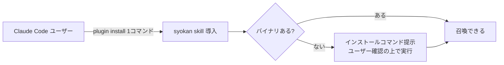

# PRD: claude-code-plugin

## Problem

syokan の主要な利用形態は「Claude Code が snapshot を組んで POST する」であり、そのための skill (`skills/syokan/`) がリポジトリに同梱されている。
しかし第三者がこの skill を使うには、リポジトリを見つけて skill ディレクトリを手元の `.claude/skills/` に手動でコピーするしかない。
バイナリのインストール (one-command-install PRD) が済んでも、Claude Code 側の導入が手作業のままでは「Claude Code ユーザーにとっての標準 view layer」として採用されにくい。

Claude Code には plugin という配布機構があり、1コマンドで skill を導入できる。
この経路に乗らないことは、ターゲットユーザーへの最短の配布チャネルを自ら捨てることに等しい。

## Overview

syokan リポジトリ自身を Claude Code plugin として配布可能にする。
plugin をインストールすると syokan skill が使えるようになり、skill は syokan バイナリの有無を確認して、未導入ならインストールへ誘導する。

### Goals

- Claude Code ユーザーが1コマンドで syokan skill を導入できる
- skill の SSOT (`skills/syokan/`) と配布物が同一リポジトリ内で一致し、drift しない
- バイナリ未導入のユーザーが、skill の誘導に従うだけでインストールを完了できる

### Non-Goals

- 配布専用の別リポジトリは作らない (skill のコピー同期が必要になり drift する)
- skill がユーザーの確認なしにバイナリを自動インストールすることはしない
- MCP server としての提供はしない (入力経路の追加は別の判断として切り出す)
- Claude Code 以外のツール (Codex 等) への plugin 配布は対象外

## Glossary

- **plugin**：Claude Code の拡張配布単位で、skill 等を含み、marketplace 経由で1コマンドでインストールできる
- **skill**：Claude Code に手順と知識を与える定義で、syokan skill は envelope の組み立てと POST の手順を持つ

## User Stories

### US-001: Claude Code ユーザーが1コマンドで skill を導入する

**説明:** syokan を知った Claude Code ユーザーが、plugin として syokan skill を導入したい。なぜならリポジトリからの手動コピーは手順の発見自体が難しく、更新の追従もできないからだ。

**受け入れ条件:**
- [ ] README に記載された1コマンドで plugin をインストールできる
- [ ] インストール後、代表として固定した依頼文 (例: 「この markdown を syokan して」) に対して skill が発火し、view の URL が返る
- [ ] plugin を更新すると、skill も最新の内容に追従する

### US-002: バイナリ未導入ユーザーが skill の誘導で導入を完了する

**説明:** plugin だけ入れたユーザーが、そのまま最初の召喚まで到達したい。なぜなら skill とバイナリの依存関係を知らないユーザーにとって、無言の失敗は離脱に直結するからだ。

**受け入れ条件:**
- [ ] バイナリ未導入の状態で skill を使うと、skill が未導入であることを伝え、インストールコマンド (one-command-install PRD の brew / curl) を提示する
- [ ] ユーザーが承諾すれば skill がインストールを実行し、続けて元の召喚依頼を完遂する
- [ ] skill が実行するのは提示したインストールコマンドそのものであり、提示と異なる操作はしない
- [ ] ユーザーが拒否した場合は、手動のインストール手順を示して終了する

### US-003: メンテナが skill を1箇所で更新する

**説明:** メンテナ (wwwyo) が、skill の修正を `skills/syokan/` への変更だけで完結させたい。なぜなら配布用コピーを別に持つと、修正のたびに同期が必要になり、忘れた時点で利用者が古い skill を掴むからだ。

**受け入れ条件:**
- [ ] `skills/syokan/` の変更がそのまま plugin の配布内容になる
- [ ] dotfiles 側のコピーを更新しなくても、plugin 利用者には反映される

## Constraints

- `skills/syokan/` がリポジトリ同梱の SSOT であるという既存の取り決めは維持する (AGENTS.md に明記済み)
- plugin の構成は Claude Code の plugin 仕様 (marketplace 定義とマニフェスト) に従う
- Claude Code の plugin 仕様で、同一リポジトリの `skills/syokan/` を配布物として参照できることを前提とする
- 着手時に plugin 仕様を確認し、前提が成立しない場合は本 PRD の形態 (同一リポジトリでの plugin 化) を再検討する
- バイナリのインストールコマンドは one-command-install PRD の成果物に依存するため、同 PRD を先行させる (先行しない場合、skill の誘導先は mise / 手動ダウンロードの現行手順になる)
- skill がインストールを実行するのは、ユーザーが明示的に承諾した場合に限る

## Functional Requirements

1. syokan リポジトリを Claude Code の plugin marketplace として公開し、1コマンドでインストールできる
2. plugin は `skills/syokan/` の skill を含み、リポジトリ上の skill と内容が常に一致する
3. skill は実行時に syokan バイナリの有無を確認する
4. バイナリ未導入の場合、skill はインストールコマンドを提示し、ユーザーの承諾を得てから実行する
5. README に plugin のインストール手順を記載する

## Success Metrics

- クリーン環境で「plugin インストール → 召喚依頼 → (誘導に従いバイナリ導入) → view が開く」までが、README の記載だけで完了する
- 導入に関する issue / 問い合わせが、手動コピー時代の想定手順 (リポジトリ発見、コピー先の特定) を前提としたものでなくなる
- plugin 経由の導入数の観測手段を確認する (marketplace 側で取れない場合は、README からの導線や導入に関する issue の傾向を代替指標とする)
