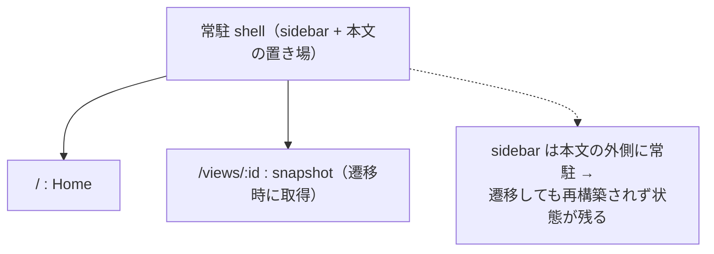

# PRD: クライアントルーティング導入

## Problem

syokan は全ページ遷移がフルリロードで起きる。
そのたびにブラウザがページを丸ごと再構築し、引き継ぎたい一時 UI 状態が破棄・再初期化される。
具体的には sidebar の開閉状態・スクロール位置・取得済みの snapshot 一覧が、遷移のたびにリセットされる。

この破棄を手で埋めるための補助コードが積み上がっている。

- sidebar の開閉を localStorage で延命している。
- 本文と sidebar のスクロール位置を sessionStorage と observer で復元している。
- sidebar は遷移ごとに再 mount され、`/api/views` を毎回再取得している。

状態を持つ chrome を足すほどこの代償が増える。
コードが「フルリロードで消えるものを手で延命する」方向に複雑化する。
加えて遷移ごとに JS バンドルの再パースと React の再初期化が走り、白い瞬間とラグが出る。

MVP 時は「ページ間で引き継ぐ状態が無い」前提で、フルリロードが正しい単純化だった。
その前提が、状態を持つ chrome の追加で崩れた。
このため遷移方式を見直す。

あわせて API リソースの分裂も解消する。
現状は作成が `POST /api/items`、一覧・取得・削除が `/api/views[/:id]` に分かれている。
同一リソース（保存される snapshot）なのに作成と読み取り/削除でパスが割れており、`item` と `view` を分ける意味が無い。
データ層を loader 化で触るこのタイミングで、単一リソースに揃える。

## Overview

ページ遷移をブラウザ内で完結させるクライアントルーティングを導入する。
一時 UI 状態がメモリ上に残り、遷移が即時になる。
延命用の補助コードを撤去する。
あわせて API リソースを単一に整理する。

### Goals

- snapshot 間・home との遷移を即時にする（白い瞬間とラグを無くす）。
- sidebar の開閉・スクロール位置・取得済み一覧を、遷移をまたいで保持する。
- 本文の読書スクロール位置を、別ページへ移動して戻ったときに保つ。
- スクロール復元のための自前補助コードを減らす。
- API を一貫した単一リソース（`/api/snapshots`）に整理し、作成と読み取り/削除のパス分裂を解消する。

### Non-Goals

- SSR は導入しない（CSR を維持する）。
- データ永続化方針は変えない（ephemeral のまま）。
- 認証・複数ユーザー・新しい画面や機能の追加はしない。
- CLI のコマンド体系（`post` / `open` / `stop`）と、人間が見るページ URL（`/views/:id`）は変えない。
- 旧 API パス（`/api/items` / `/api/views`）の後方互換は維持しない（即時切替）。

## Glossary

- **フルリロード**: リンク遷移のたびにブラウザが HTML と JS を再取得し、ページを丸ごと再構築すること。
- **クライアントルーティング**: ブラウザ内で URL とビューを切り替え、ページの丸ごと再構築を避ける方式。
- **CSR**: サーバは静的 HTML を返すだけで、画面はブラウザの React が描画する方式。
- **SSR**: サーバ側で HTML を生成して返す方式。CSR の対義。
- **chrome**: 本文の外側に常駐する画面枠（sidebar・ヘッダ等）。snapshot の描画内容とは別レイヤー。
- **白い瞬間**: 遷移時に内容が消え、背景だけが一瞬表示される状態。
- **loader**: route ごとに紐づくデータ取得処理。ルータが取得・保留・エラー状態を扱う。
- **scrollRestoration**: 遷移時にスクロール位置を保存・復元するルータの標準機能。
- **Item**: catalog component 1 ノードを表す schema 型（`type Item` / `itemSchema`）。snapshot の `root` がこの Item の木になる。
- **snapshot**: 保存される 1 単位（id・root の Item 木・title・metadata・作成時刻）。API リソースの実体。
- **pierre**: コード/差分描画に使う `@pierre/diffs`。shadow DOM 内で Shiki ハイライトする。

## User Stories

### US-001: snapshot 間を即時に移動する
**説明:** snapshot を次々に確認する利用者として、一覧から続けて開きたい。
なぜなら、開くたびに白い瞬間とラグが入ると見る作業が途切れるため。

**受け入れ条件:**
- [ ] 一覧の項目をクリックすると、ページ全体の再読込（document navigation）なしに内容が切り替わる。
- [ ] 切り替え中に白い瞬間が出ない。
- [ ] 直接 URL アクセス・リロード・戻る/進むでも、対応するページが表示される。

### US-002: 一覧の位置と開閉が遷移後も保たれる
**説明:** 利用者として、一覧をスクロールして開いて戻ったとき、一覧の位置と開閉状態が保たれていてほしい。
なぜなら、毎回先頭に戻ると見ていた場所を探し直すことになるため。

**受け入れ条件:**
- [ ] sidebar を開いた状態で遷移すると、開いたままになる。
- [ ] sidebar をスクロールした位置は、遷移後も保たれる。
- [ ] 遷移のたびに一覧の再取得による読み込み表示が出ない。
- [ ] 一方で、snapshot を作成/削除した後は一覧が最新化される（古い行が残らない）。

### US-003: 本文の読書位置が遷移後に復元される
**説明:** 長い snapshot を読む利用者として、別ページへ行って戻ったとき、読んでいた位置に戻りたい。
なぜなら、毎回先頭からスクロールし直すのは負担なため。

**受け入れ条件:**
- [ ] 長い snapshot を途中までスクロールし、別ページへ移動して戻る（戻る/進む・同一 URL 再訪）と、元の位置が復元される。
- [ ] 別の（初めて開く）snapshot は先頭から表示される。

## Constraints

決定済みの前提・依存・リスクを示す。

- TanStack Router を採用する。code-based route で構成し、Vite プラグインは使わない（Bun の bundler に載せる）。loader・scroll 復元・pending/error・常駐レイアウトの要求を満たす手段としての選定。
- CSR を維持し、SSR は入れない。
- 直接 URL アクセス（API 以外の任意パス）にはサーバが SPA の HTML を返す。`/api/*` は据え置き、未知の `/api/*` は JSON 404 を返す（HTML を返さない）。
- 本文スクロールはルータの標準 scroll 復元に委ねる。これに伴い本文を document（window）スクロールへ戻し、sidebar は固定にする。fullBleed / resizable Stack のページが従来どおり成立することを要件とする（現状の `h-svh overflow-hidden` + 独立スクロール構成からの変更でありリスク）。
- snapshot 取得はルータの loader が担う。pending・not-found・error の表示を持つ（現 `ViewPage` の loading/not-found/error を維持）。
- 一覧（常駐 sidebar）は作成/削除の後に invalidate して最新化する（常駐ゆえ stale になりうるため）。
- API リソースを `/api/snapshots` に一本化する（作成 `POST` / 一覧 `GET` / 取得 `GET /:id` / 削除 `DELETE /:id`）。名前は schema の `Item`（tree ノード型）との衝突を避け、保存層の `snapshot` 語彙に合わせる。
- API の I/O 契約は現状を踏襲する（作成は `idempotencyKey` を受け `{ id, url, snapshot }` を返す、一覧は `{ items }`、DELETE の 404 挙動）。
- 旧パス `/api/items` / `/api/views` の後方互換は維持しない（即時切替の breaking change）。利用者は本人と自前 CLI のみ。CLI・README・Home 表示を新パスに追従させる。
- 人間が見るページ `/views/:id` は据え置く。
- 自前の `useScrollRestore`（observer 復元）は撤去する。sidebar 開閉の localStorage 永続は残す（hard reload 後も開閉を保つため。client 遷移中はメモリで保つ）。
- AGENTS.md の「クライアントルーティングを採用しない」方針行を更新する（意図的な方針転換であり、明示する）。
- 依存追加は供給網ポリシーに従う（bunfig の exact ピン + cooldown 7日）。
- リスク（実装時に検証）: pierre（shadow DOM + Shiki）と base-ui の portal（context menu / dropdown）が、クライアント遷移で正しく unmount・再描画され、テーマ追従・高さ計測・copy などが壊れないこと。

## Functional Requirements

1. home と snapshot 閲覧ページ間の遷移は、フルリロードせずブラウザ内で完結する。
2. 直接 URL アクセス・リロード・ブラウザの戻る/進むで、URL に対応するページが表示される。
3. sidebar は client 遷移をまたいで、開閉状態・スクロール位置・取得済み一覧を保持する。hard reload 後も開閉状態は保つ（スクロールと一覧は再構築でよい）。
4. 本文の読書スクロール位置は、戻る/進む・同一 URL 再訪で復元される（履歴 entry 単位）。初めて開くページは先頭から表示する。
5. snapshot を作成/削除した後、常駐する sidebar の一覧は最新化される（stale な行が残らない）。
6. snapshot 削除後は、一覧を最新化したうえで隣（次→前）の snapshot へ即時遷移する。残りが無ければ home へ遷移する。算出した遷移先が既に削除済み（404）なら home へ fallback する。
7. snapshot 取得中は pending を、存在しない id は not-found を、取得失敗は error を表示する（現挙動を維持する）。
8. API は単一リソース `/api/snapshots` に統一する（作成 `POST` / 一覧 `GET` / 取得 `GET /:id` / 削除 `DELETE /:id`）。I/O 契約は現状を踏襲する。
9. CLI のコマンド（`post` / `open` / `stop`）の使い方と、人間が見るページ URL `/views/:id` は変わらない。CLI は内部で `/api/snapshots` を叩く。旧 API パスは廃止する。

## Success Metrics

各 Goal / Functional Requirement に最低 1 つ、検証可能な基準を対応させる。

- client 遷移時に document の再読込が発生しない（遷移で full document load が 0 件）。
- 一覧から open する操作・削除後遷移で、白い瞬間（blank frame）が観測されない。
- 戻る/進む・同一 URL 再訪で本文の読書位置が復元される。
- snapshot 作成/削除の後、一覧に反映される（stale な行が残らない）。
- 自前の `useScrollRestore` が削除され、scroll 延命の自前コードが純減する。
- API パスが `/api/snapshots` 単一に統一され、旧 `/api/items` / `/api/views` が消える。
