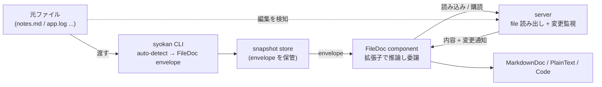

# File Source Sync

手元のファイル (json / markdown / txt / log) を syokan に渡して表示し、元ファイルの変更を view に反映する。

## Problem

syokan は「複数リポジトリ・外部 API・ファイルシステムから取得したデータを構造化 UI で見る」ための view layer である。
だが現状の入力は JSON envelope に限られ、手元のファイルをそのまま渡す経路が無い。

CLI は `syokan <file.json>` を envelope として解釈するため、`syokan notes.md` は `invalid_json` で落ちる。
markdown や log を見たい場合、利用者は `MarkdownDoc` / `PlainText` catalog を使った envelope を自分で組み立てる必要がある。
これは AGENTS.md が掲げる利用シーン「共有された議事録 markdown をその場で開いて見たいだけ」と噛み合わない。
「ファイルを渡す」という単純な操作に、envelope 手組みという手間が挟まっている。

さらに、一度表示した内容はその時点の写しで固定される。
元ファイルを編集しても view は古いままで、再度 envelope を組み直して投げ直す必要がある。
このため、内容が変化し続けるファイルを見る用途が成立しない。
具体的には次のような用途である。

- 追記される log を、サイズ上限の範囲で通して確認する。
- 編集中のメモを、エディタで直しながら整形結果を隣で見る。
- 生成途中の成果物 (markdown レポート等) が書き足されていく様子を追う。

これらは「表示した瞬間の写し」では失敗し、毎回投げ直す運用では編集と確認の往復に使いにくい。
ファイルを source of truth とし、その変更に追従する view が要る。

この 2 つ (渡す手間 / 写しの固定) を解消する。

## Overview

ファイルパスを参照する catalog component を 1 つ追加する (本 PRD では仮に `FileDoc` と呼ぶ)。
`FileDoc` は props に渡されたパスのファイルをサーバ経由で読み、拡張子から描画形式を推論して既存の表示 component に委譲する。
サーバはそのファイルを監視し、変更があれば view に通知する。
`FileDoc` は通知を受けて再読込し、view を更新する。

CLI は `syokan <path>` で、内容が envelope なら従来どおり post し、そうでなければ `FileDoc` envelope に自動で包んで post する。
これにより利用者は「ファイルを渡すだけ」で、元ファイルの変更に追従する view を得る。

ファイル参照は envelope や store のレベルではなく、catalog node 1 個に閉じ込める。
こうすると snapshot envelope は従来どおり catalog tree だけを持ち、store は「ファイルを参照している snapshot」を特別扱いしない。
「いつ読み直すか」は envelope ではなく `FileDoc` component の責務となり、普通の catalog node と同じ snapshot に混在できる。

ただし file-backed な view は、表示内容の再現性を元ファイルに依存する。
envelope はファイルへの参照を持つだけで、元ファイルが変われば表示も変わり、元ファイルが消えれば表示は再現できない。
この点で file-backed snapshot は、内容を自身に持つ従来 snapshot とライフサイクルが異なる。
本 PRD はこの差を許容し、envelope/store の永続データにファイル内容を持ち込まないことで ephemeral 原則 (データを永続化しない) を保つ。

live forward sync の対象は、ファイル参照ノードを持つ file-backed view に限る。
envelope schema を満たす JSON ファイルは従来どおり内容を写した通常 snapshot として post され、元ファイルを編集しても追従しない。

`FileDoc` component や変更監視の方式 (SSE / polling / 再 POST 等) は、設計フェーズで確定する候補であり、本 PRD では固定しない。
記載の機構名は、合意した方向を記録するためのものである。

### Goals

- ファイルを CLI に渡すだけで、envelope を手で組まずに syokan に表示できる。
- 元ファイルの変更を、利用者の操作なしに file-backed view へ反映する (forward sync)。
- ファイル内容を snapshot store の永続データに持ち込まず、ephemeral 原則を保つ。
- ファイル参照を伴わない従来 snapshot の利用を、一切壊さない。

### Non-Goals

- **逆方向 sync (view 編集 → ファイル書き戻し)**。
  view を編集可能にするのは read-only な render 層という syokan の責務を超え、編集 UI・write endpoint・変更監視との競合処理を抱え込む。
  本 PRD では対象外とし、必要になった時点で別 PRD として扱う。
- **巨大化し続ける log の tail 表示・rotation・truncate 追従**。
  MVP はサイズ上限内の full-file 再描画に限る。
  末尾 N 行表示や rotation 追従は本 PRD では対象外とし、必要になった時点で別 PRD として扱う。
- **ファイルを持たない既存 envelope の sync**。
  通常 snapshot には追従すべき source が無く、ファイル参照ノードの外に対象が存在しない。
  本 PRD では対象外とする。
- **表示形式の明示指定と envelope JSON の強制 live 表示**。
  描画形式は拡張子推論に一本化し、上書きフラグ (`--as` 等) は持たない。
  これにより描画形式が path の純関数となり、file-backed view の識別子が絶対パスのみに定まる。format を識別子に含める分岐や、同一 path への形式上書き (先勝ち idempotency と衝突して指定が黙殺される) を抱えずに済む。
  代償として、拡張子と中身が一致しないファイル (拡張子なしの markdown 等) はプレーンテキスト表示になり、valid な envelope JSON をあえて file-backed として live 表示する escape hatch も持たない。前者は rename / 拡張子付き symlink で回避でき、後者は edge case のため、いずれも対象外とし必要になった時点で別 PRD として扱う。
- **リモート URL の取得・表示**。
  本 PRD はローカルファイルパスのみを扱う。
  HTTP source は対象外とし、必要になった時点で別 PRD として扱う。
- **ファイル読み出しのアクセス制御 (ディレクトリ allowlist 等)**。
  個人用・localhost 限定の信頼モデルを前提に制限なしとする。
  ファイル参照ノードは catalog component であり、CLI 由来か否かを問わず任意の envelope が含みうる。
  信頼できない envelope からの任意ファイル参照リスクは Constraints に記し受容する。
  allowlist は本 PRD では対象外とし、必要になった時点で別 PRD として扱う。

## Glossary

- **envelope**：syokan が受け取る JSON の入れ物で、`root` (catalog tree) と metadata を持つ (schema は README が SSOT)。
- **catalog component**：LLM / CLI が JSON で指定して描画させる事前定義済みの React component (型と props は `src/catalogs` が SSOT)。
- **FileDoc**：ファイルパスを受け取り、内容を読んで描画形式を推論し既存の表示 component に委譲する、本 PRD 追加のファイル参照ノードの仮称。
- **file-backed snapshot**：root にファイル参照ノードを含み、表示内容の再現性が元ファイルに依存する snapshot。
- **forward sync**：ファイル (source) の変更を view へ反映する方向 (本 PRD の対象)。
- **ephemeral 原則**：syokan はデータを永続化せず、snapshot を再構築可能な一時データとして扱う設計方針。

## User Stories

### US-001: ファイルを渡してそのまま表示する
**説明:** 手元にファイル (議事録 markdown / 設定 json / アプリ log) を持つ利用者が、`syokan <path>` を実行するだけで syokan の構造化 UI に表示したい。
なぜなら、envelope を手で組み立てる手間なく、共有されたファイルをその場で見たいから。

**受け入れ条件:**
- [ ] `syokan notes.md` を実行すると view URL が出力され、開くと markdown が整形表示される。
- [ ] `.txt` / `.log` はプレーンテキストとして等幅で表示される。
- [ ] `.json` はハイライト整形されたコードとして表示される。
- [ ] JSON として解釈でき、かつ envelope schema を満たすファイルは、従来どおり envelope として解釈される。
- [ ] JSON だが envelope schema を満たさないファイルは、コードとして表示される。
- [ ] envelope でも既知拡張子でもないファイルは、プレーンテキストとして表示される。

### US-002: ファイルの編集が view に反映される
**説明:** メモや log を編集・追記する利用者が、元ファイルを変更したら syokan の view が自動で最新化されてほしい。
なぜなら、エディタで直しながら反映結果を確認したく、毎回投げ直す運用では編集と確認の往復に使いにくいから。

**受け入れ条件:**
- [ ] view を開いたまま元ファイルを保存すると、利用者が操作しなくても数秒以内に表示が更新される。
- [ ] エディタの保存方式 (テンポラリ書き込み → rename) でも、更新が取りこぼされない。
- [ ] その file-backed view を表示しているタブをすべて閉じてから一定時間内に、そのファイルの監視が解放される (時間は設計で定める)。

### US-003: 表示できないファイルで壊れない
**説明:** 参照先が削除された / 巨大 / バイナリ / 通常ファイルでないパスを開いた利用者に、view が固まったり読めない内容を表示したりせず、状況を伝えてほしい。
なぜなら、何が起きたか分からないまま表示が壊れるのを避けたいから。

**受け入れ条件:**
- [ ] 参照先のファイルが存在しない、または監視中に削除された場合、本文の代わりに「見つからない / 削除された」旨が表示される。
- [ ] サイズ上限を超えるファイルは本文を出さず、大きすぎる旨が表示される。
- [ ] バイナリ / 非 UTF-8 ファイルは、読めない内容を表示せず、表示できない旨が示される。
- [ ] 通常ファイルでないパス (ディレクトリ / FIFO / socket / device) や権限不足のパスは、読み取りを試みて固まらず、表示できない旨が示される。

### US-004: 同じファイルの view が 1 つに収束する
**説明:** 同じファイルを複数回 `syokan <path>` で渡す利用者に対し、view を 1 つに保ち URL を安定させたい。
なぜなら、同じ対象の view が一覧上で重複するのを避けたいから。

**受け入れ条件:**
- [ ] 同一の絶対パスを再度渡すと、新しい snapshot を作らず同じ view URL が返る。
- [ ] 収束した view URL は、サーバ再起動をまたいでも同じ snapshot を指す。

### US-005: 複数のファイル参照を 1 つの view にまとめる
**説明:** LLM / skill が組む envelope の作者が、1 つの snapshot に複数のファイル参照ノードを並べて表示したい。
なぜなら、ファイル参照ノードは通常の catalog component であり、他ノードと混在・並置できるべきだから。

**受け入れ条件:**
- [ ] 同一 snapshot 内の複数のファイル参照ノードが、それぞれ独立に読み込まれ表示される。
- [ ] そのうち 1 つの元ファイルを変更すると、その node だけが更新される。
- [ ] 1 つの参照先が表示できない状態でも、他の node の表示は壊れない。

## Constraints

- **配布形態は単体バイナリ (`bun build --compile`)**。
  ファイル監視に native addon (chokidar の `fsevents` 等) を使う場合、単体バイナリへの埋め込み可否が制約になる。
  Bun ネイティブの `fs.watch` を含め、監視機構の選定は設計フェーズで単体バイナリ互換性を前提に判断する。
- **エディタの保存はテンポラリ書き込み → rename (inode 差し替え) が多い**。
  素の `fs.watch` は監視を見失うため、再監視で吸収する機構が要る (US-002 の取りこぼし防止条件)。
- **信頼境界は「localhost bind ＋ ユーザー権限」**。
  ファイル読み出しに制限を設けない前提は、サーバが localhost に bind しユーザー権限で動くことに依存する。
  bind 範囲を外部公開に変える場合は、この前提が崩れるため再検討が要る。
  残存リスク: ファイル参照ノードは任意の envelope (scheduled agent / webhook / paste 由来) が含みうるため、機微ファイルへの参照を仕込まれると画面経由で内容が露出しうる。
  個人用途で受容する。
- **ファイル監視は接続スコープの runtime state**。
  view が開いている間だけ watcher を持ち、view を閉じたら解放する。
  これは永続化するデータではなく (lock file や in-memory mutex と同類)、ephemeral 原則は維持される。
- **catalog の型と props は `src/catalogs` が SSOT**。
  `FileDoc` を追加したら manifest 経由で `GET /api/catalog` に自動公開され、skill はそこから props 契約を引く。
- **CLI の入力解釈を file に限って変更する**。
  従来「CLI はテキストを包まない、catalog 表現は LLM/skill の仕事」だったが、`FileDoc` への auto-wrap に限りこれを改める。

### 設計フェーズで解決すべきリスク・未決事項

以下は本 PRD では結論を固定せず、設計フェーズで扱う。
ただし path 正規化・複数タブ・log の truncate は US-004/US-002 の検証条件に直結するため、設計で必ず定義する。

- 絶対パスの正規化方針 (symlink / 相対パス / `..` / case-insensitive FS / ホームディレクトリ表記) と、それを識別子としてどう扱うか。
- 複数タブで同じ file-backed view を開いた場合の、監視数・接続数・更新の順序と、監視解放の timeout。
- サーバ再起動時に、開いたままの view が再接続して最新内容を復元するか。
- ファイル削除後に同じパスで再作成された場合、同じ live view として復帰するか。
- 追記中 log の部分書き込み・truncate・連続 rename が起きたときの表示の振る舞い。
- サイズ上限の具体値。
- ファイル移動・別マシンへの移行時、file-backed view が壊れる前提の利用者への伝え方。

## Functional Requirements

1. catalog に、ファイルパスを props に持つファイル参照ノード (`FileDoc`) を追加する。
2. ファイル参照ノードは拡張子から描画形式を推論する (`.md`/`.markdown`→markdown、`.txt`/`.log`→プレーンテキスト、`.json`→コード)。
3. 未知拡張子・拡張子なしは、プレーンテキストとして描画する。
4. ファイルの読み出しと変更監視は、サーバ側が担う。
5. サーバはファイル変更を検知し、view へ通知する。エディタの rename 保存でも取りこぼさない。
6. view を閉じてから一定時間内に、対応するファイル監視を解放する。
7. ファイル参照ノードは、初回表示時に内容を読み、変更通知を受けて再読込し view を更新する。
8. 同一 snapshot 内の複数のファイル参照ノードは、それぞれ独立に読み込み・監視・エラー表示する。
9. 対象は通常ファイルのみとし、ディレクトリ・FIFO・socket・device・権限不足のパスは読み取りで固まらず表示不可状態にする。
10. 参照先が存在しない、または削除された場合、本文の代わりに欠落状態を表示する。
11. サイズ上限を超えるファイルは、本文を返さず超過を示す。
12. バイナリ・非 UTF-8 ファイルは表示不可として扱い、読めない内容を表示しない。
13. CLI は `syokan <path>` で内容を読み、JSON として解釈でき envelope schema を満たすなら従来どおり post する。
14. envelope schema を満たさない場合、CLI は絶対パスに解決した上でファイル参照ノードの envelope に包んで post する。
15. CLI は auto-wrap した envelope に、title と source.label をファイル名 (basename) で設定する。
16. file-backed view の識別子は、絶対パスとする。
17. 同じ識別子の再 post は dedup し、同じ snapshot/URL を返す。
18. localhost bind を信頼境界とし、ファイル読み出しにアクセス制御を課さない。

## Success Metrics

- ファイルを渡してから表示まで、envelope の手組みが要らない (操作は `syokan <path>` のみ)。
- 元ファイル保存から view 更新までが数秒以内で、利用者の操作を要しない。
- `FileDoc` 追加後も、snapshot store のコードがファイル参照を特別扱いしない。
- 異常系 (欠落 / 巨大 / バイナリ / 非通常ファイル) で、ブラウザが固まる・読めない内容を表示する事象が出ない。
