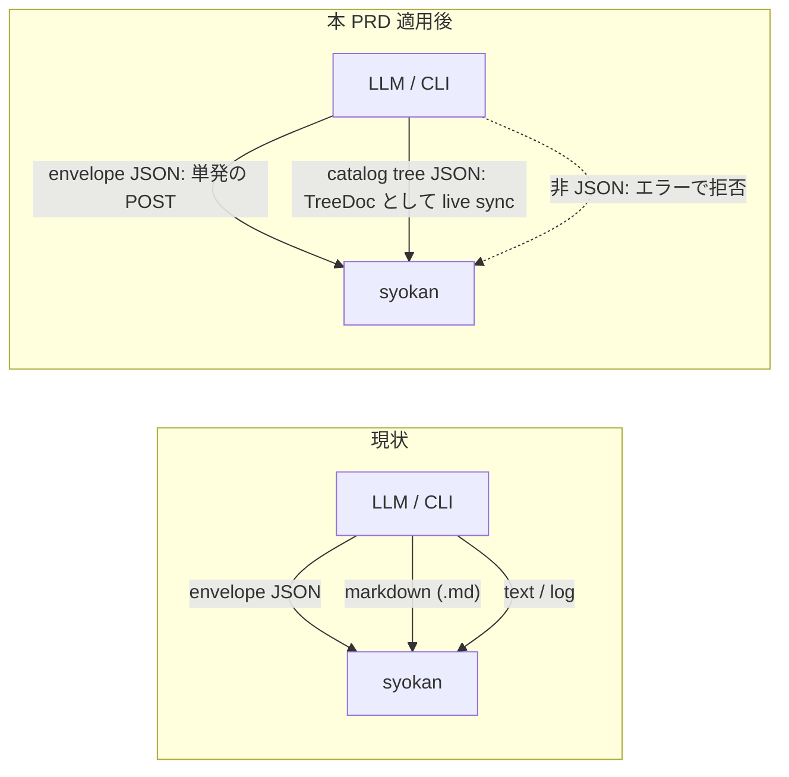

# PRD: json-only-view

## Problem

syokan の設計原則は「LLM は構造化した JSON (catalog tree) を投げ、レンダリングは catalog が一度だけ設計して再利用する」である。
しかし現状は markdown という第二の表現パスが存在する。
具体的には、markdown 文字列をそのまま描画する MarkdownDoc node、`.md` ファイルを markdown として描画する FileDoc、非 JSON ファイルを FileDoc に包んで受け付ける CLI の auto-wrap の3つである。

表現パスが catalog tree と markdown の二系統あることには2つのコストがある。
第一に、LLM は構造化を挟まない markdown 直渡しを選べるため、catalog の表現力に欠落があってもそれが顕在化せず、catalog を改善する動機が働かない。
第二に、markdown 経由の表示規則は md→React のマッピング層が別に決めるため、catalog で揃えたい表示規則と二重管理になり、見た目の一貫性を維持しにくい。

live sync (ファイル編集がビューに追従する仕組み) にも欠けがある。
現状の FileDoc は `.json` ファイルを Code (シンタックスハイライト付きのソース表示) としてしか描画できず、JSON を catalog tree として解釈して描画する受け皿がない。
LLM の出力先をファイルにすれば POST を繰り返さずビューを更新し続けられるはずだが、その JSON を「見るための UI」として描画する手段が markdown 側 (`.md` を書き換える) にしかない。

syokan には作者以外の利用者がおらず、互換性を保つべき公開データも存在しない。
入力仕様を破壊的に整理できるのは今である。

## Overview

syokan が受け付ける表現を catalog tree に統一する。
入力経路は「envelope JSON の単発の POST」と「catalog tree JSON ファイルの live sync」の2つになるが、どちらも中身は catalog tree であり、markdown を含む非 JSON の表現は受け付けない。

markdown 対応 (MarkdownDoc node、FileDoc の markdown 描画、非 JSON ファイルの受け付け) を削除し、ファイル参照 node を FileDoc から **TreeDoc** に置き換える。
markdown 削除と TreeDoc 導入を1つの PRD で扱うのは、FileDoc を削除すると live sync の受け皿が消えるためである。
TreeDoc は FileDoc の後継として live sync の受け皿を引き継ぎ、その対象をテキストから catalog tree に変える。

TreeDoc はローカルの catalog tree JSON ファイルを参照する node で、参照先の tree を subtree として描画し、ファイルの編集に追従して再レンダリングする (Glossary の定義もこの動作を指す)。
LLM が JSON ファイルを書き換え続けることで、POST を繰り返さずにビューを更新し続けられる。
FileDoc と同様、ファイル参照は node に閉じるため、静的な node と TreeDoc を同一 view 内に混在できる。

TreeDoc の参照先の契約は FileDoc のものを引き継ぐ。
`path` は CLI が正規化した絶対パスのみで、URL は指定できない。
参照先は通常ファイルの UTF-8 テキストで、サイズ上限を超えるものは読まない。
参照先の tree の中に TreeDoc を入れ子にすることはできない (循環参照と無限展開を仕組みごと排除するため)。

書きかけの JSON (parse 不能または catalog schema 違反) を読んでもビューは壊さない。
直前の正常な表示を維持したまま TreeDoc の表示領域内にエラーの種別と参照先パスを表示し、ファイルが正常に戻れば追従を再開する。
初回参照の時点で不正な場合は、正常表示がないためエラー表示のみになる。

markdown で表現していた図は、mermaid を独立した catalog type (**Mermaid**) に昇格して維持する。
PlainText / Code / Diff などの既存 catalog type は削除しない。
一方、markdown 文書としての閲覧性 (見出し、リスト、表、リンクを一体の文書として読む体験) は捨てる。
見出しや本文は Heading / Text で組み直せるが、表やチェックリストに相当する catalog type は現状なく、これらの表現は本 PRD の時点では失われる (必要になったら別 PRD で catalog type を追加する)。
markdown ファイルを読みたいユースケース (議事録をその場で開く等) も同様に、「LLM が md を catalog tree JSON に変換してから syokan」というフローに置き換わる。

### Goals

- syokan が受け付ける表現を catalog tree に統一し、「LLM は構造化した JSON を投げる」原則に例外をなくす
- LLM が JSON ファイルを書き換えるとビューが追従する live sync (TreeDoc) を成立させる
- markdown のレンダリング経路 (MarkdownDoc と md→React マッピング層) を、catalog 外の内部利用も含めてなくす
- mermaid 図の表現力を独立した catalog type として維持する

### Non-Goals

- 非 JSON ファイル (md / log / txt) の閲覧サポートは提供しない。伸び続けるログを直接開くユースケースも捨てる (非 JSON の受け付けを残すと第二の表現パスが存続するため。ログ閲覧は定着した実績がなく、必要になったら別 PRD で再検討する)
- Mermaid を除き、catalog の表現力拡張はしない (markdown で表現できて catalog で表現できない構造が見つかったら、別 PRD で catalog type を追加する)
- 既存の永続データ (template、published share) の migration はしない。本 PRD は破壊的変更であり、MarkdownDoc と FileDoc を含む古い template は取得はできるが再投稿すると validation エラーになり、古い share は該当 node だけ未知 type 用の fallback 表示になる
- ephemeral 原則は変えない (TreeDoc の参照先ファイルの内容を envelope / store に持ち込まない)

## Glossary

- **catalog tree**：catalog type の node からなる JSON の木。envelope の root 以下に置かれる描画対象
- **envelope**：`POST /api/snapshots` が受け付ける JSON。メタ情報 (source 等) と catalog tree を包む
- **TreeDoc**：本 PRD で導入する catalog node。ローカルの catalog tree JSON ファイルを参照し、その内容を subtree として描画し、変更に追従する。FileDoc の後継
- **live sync**：参照先ファイルの編集がビューの再レンダリングとして反映されること

## Acceptance Criteria

- [ ] MarkdownDoc と FileDoc が catalog から消え、`GET /api/catalog` に含まれず、これらを含む envelope は validation エラーで拒否される
- [ ] アプリの依存関係から markdown レンダラー (react-markdown / remark-gfm) が消え、catalog 外の内部画面も markdown 描画を使わない
- [ ] TreeDoc の `path` に相対パス、URL、空文字を渡した envelope は validation エラーで拒否される
- [ ] TreeDoc の参照先がファイルとして読めない場合 (欠落、通常ファイル以外、サイズ超過、非テキスト等) は、その種別と参照先パスが TreeDoc の表示領域に表示される
- [ ] `Mermaid` type を含む envelope で mermaid 図が描画され、`GET /api/catalog` にその props 契約が含まれる
- [ ] `syokan <envelope.json>` は従来どおり単発の POST として送信され、静的な view として表示される
- [ ] `syokan <tree.json>` (裸の catalog tree JSON) は TreeDoc として召喚され、ファイルを編集して保存するとビューがページ再読み込みなしに更新される
- [ ] 同じパスの tree JSON を再度 `syokan` しても snapshot は増殖せず、同じ view URL が返る
- [ ] `syokan notes.md` など非 JSON ファイル、および envelope でも catalog tree でもない JSON は、エラー種別と期待する入力形式を含む JSON を stderr に出力して exit code 1 で拒否される
- [ ] sync 中に参照先 JSON が不正 (parse 不能 / schema 違反) になっても直前の正常表示が維持され、TreeDoc の表示領域内にエラー種別と参照先パスが表示され、ファイルが正常に戻ると追従が再開する
- [ ] TreeDoc を含む envelope が初回参照時点で不正な JSON ファイルを指す場合、TreeDoc はエラー種別と参照先パスを表示する
- [ ] 参照先の tree に TreeDoc が入れ子で含まれる場合、その node は展開されずエラーとして扱われる (自己参照でも無限再帰しない)
- [ ] 静的な node と TreeDoc を同一 view 内に混在して表示できる
- [ ] TreeDoc を含む view を publish すると、その時点で読める正常な tree が凍結されて共有され、公開 payload に TreeDoc は残らない。参照先が読めない場合や不正な場合は publish が失敗として報告される
- [ ] share Worker API も TreeDoc を含む payload を拒否する (local の凍結が主防御、Worker 側は最後の防御)
- [ ] syokan skill と README の catalog 一覧・使用例から markdown への言及が消え、TreeDoc / Mermaid の使い方が記載されている
