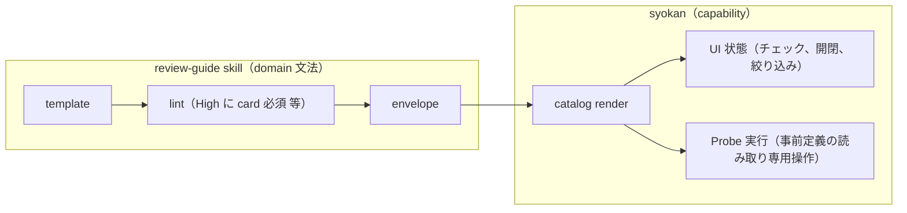

# PRD: review-cockpit

## Problem

review-guide skill が生成するリスクパネルは、単一の Markdown ファイルを FileDoc で表示する構成であり、表現が markdown の範囲に制約される。
この制約はすでに 4 箇所で運用を歪めている。

- **畳めない。**
  MarkdownDoc は raw HTML（`
`）を render しないため、優先度の低い情報を「畳む」代わりに「書かない」で対処している（None や未確認の詳細 card を削除する運用）。
  「読み手に一度に見せる情報を最小にする」という review-guide の中核原則を、情報の削除で代替している。
- **構造が文字列に潰れ、飛べない。**
  severity と confidence は生成時に `**High・疑い**` という太字文字列になり、view からは絞り込みも集計も該当 card への移動もできない。
  見出しに anchor が付かないため、節間参照は「→ §4」という文字表記で代替している。
- **測り直せない。**
  「問題なし（None）」の根拠として書かれた確認コマンドは散文であり、PR に commit が追加されてもパネルは古い結果を表示し続ける。
  偽グリーン（問題があるのに問題なしと表示すること）を防ぐ仕組みが、生成時の LLM の自己申告に依存している。
- **図が安定しない。**
  依存関係の before と after の対比は mermaid fence で描けるが、生成された構文の誤りがそのまま描画の失敗になる。
  また「追加」「削除」「問題の集中点」といった意味分類への色や線種の割り当てが生成のたびに揺れ、図の読み方を view 側が保証できない。

加えて、レビューは中断を挟む作業なのに、view はどこまで確認したかを覚えない。
読み進めても画面上の情報量は減らず、開き直すと最初からになる。

さらに、生成側がこれらの render 能力と制約を知る手段が無い。
`syokan catalog` は catalog type と props の schema を返すが、MarkdownDoc が render できる表現（対応する fence 言語、info string のファイル名解釈、task list の checkbox 表示、raw HTML と見出し anchor の非対応、mermaid の fallback 挙動）は取得できない。
このため review-guide skill はこれらを skill 本文に手書きで転記しており、syokan 側の変更に追従できず陳腐化する。

MarkdownDoc に `
` 相当と見出し anchor を足すだけの案では、「畳めない」「飛べない」は緩和できるが、severity や確認コマンドが文字列のままなので絞り込み、進捗の保持、確認の再実行は成立しない。
このため view の構成要素そのものをデータとして持つ必要がある。

一方で syokan の価値は「catalog の組み合わせで view を自由に組める」柔軟性にある。
review 専用の一枚岩 component を足すとこの柔軟性を損なうため、review-guide-flagship PRD は「review-guide 専用の catalog type は追加しない。不足が観測されたら catalog-expansion の枠組みで別途判断する」と定めた。
本 PRD はその「観測された不足」への回答であり、リスクパネルに必要な能力を「review 以外の view でも意味を持つ」汎用の横断機構と primitive に分解して catalog に足す。
review の文法（どの観点を出すか、None に確認方法を必須にするか等）は syokan には持ち込まず、review-guide skill 側に置いたままにする。

## Overview

catalog に横断機構 3 つと primitive 群を追加し、リスクパネル相当の view を catalog の組み合わせだけで構成できるようにする。
価値は「横断機構 → Collapsible → Checklist → Probe → Graph」の順に積み上がり、横断機構と Collapsible までで Problem に挙げた「畳めない」「飛べない」は解消する。

目標体験は同梱の [review-panel-sample.html](./review-panel-sample.html)（操作可能な HTML モック）で示す。
モックのどの挙動が本 PRD の対象かは「同梱モックのスコープ」で定める。

### 横断機構

個別の component ではなく、全 node に効く仕組みとして追加する。

1. **node id と view 内 anchor**：任意の node に id を付与でき、Link がそこへ移動できる。これが無い場合、追加した情報へ直接移動できず、view は先頭から順に読む文書に留まる。
2. **node 単位の UI 状態保持**：開閉やチェックなどの操作状態を、snapshot データとは分離してその端末のブラウザ内にのみ保持する。中断しても同じ確認位置と進捗に戻れるようになる。
3. **tag による表示の絞り込み**：node に tag を付与でき、絞り込み操作で tag の一致する node 群だけを表示できる（例: 判定が High の card だけを見る）。適用範囲は絞り込み操作を持つ container の配下に限る。絞り込みはこの機構が担い、Table など個別の type には持たせない。

### primitive

- **Collapsible**：summary と本文を持ち、開閉できる。review 以外では RSS の既読記事の畳みなどに使える。
- **Checklist の操作可能化**：catalog-expansion の「チェック操作は実装しない」という決定を改訂する（「catalog-expansion との関係」参照）。チェック数の集計を表示し、チェックした項目は畳み表示に連動する。TODO の消し込みなどに使える。
- **Probe**：事前定義された読み取り専用の確認操作と、その最終実行結果を保持し、view 上から再実行できる node。任意の shell 文字列は実行できない。初期の種別は「指定 path 群に base からの差分が無いことの確認」「検索の一致件数の確認」「ファイルの存在確認」の 3 つとし、各種別は引数、結果の形、stale 判定に使う対象 ref を定義して持つ。review 以外では CI 状態やディスク使用量の確認などに拡張できる。
- **Graph**：role（追加、削除、問題の集中点、中立）付きの有向グラフ。role への色と線種の割り当ては syokan 側が固定する。静的な描画に限り、graph 上の操作は提供しない。依存関係やフローの before と after の対比に使える。

型定義単位の diff 表示（変更された interface や schema を、その定義だけ切り出して差分で見せる形式）は既存の Diff と Badge の組み合わせで賄えるため、新規 primitive は追加しない。

### 同梱モックのスコープ

| モックの要素 | 扱い |
|------|------|
| cockpit 表の行から該当 card への移動と強調表示 | 対象 |
| 「High のみ」絞り込み | 対象 |
| 証拠 hunk の開閉 | 対象 |
| 確認チェック、card の畳み、進捗の集計 | 対象 |
| Probe の再実行と stale 表示 | 対象 |
| before と after の依存図 | 対象 |
| 「作者に聞く」ボタンと返答表示 | 対象外（後続 PRD。「Non-Goals」参照） |
| GitHub への review 送信、下書き保存、toast | 対象外（agent 側の責務） |
| 権限差バー | 対象外（必要が観測されたら catalog-expansion の枠組みで判断） |
| 型定義単位の diff 表示 | 対象外（既存の Diff と Badge の組み合わせで実現） |

### catalog-expansion との関係

catalog-expansion PRD は追加 type を表示専用と定め、その理由を「view から状態を書き戻すことは ephemeral 原則に反する」とした。
本 PRD はこの決定を Checklist について次の整理で改訂する。
ephemeral 原則が禁じるのは snapshot **データ**の永続保証であり、チェックや開閉といった **UI 状態**はデータと分離した端末ローカルの状態として持つ。
snapshot 本体は不変のままであり、UI 状態が失われても失うのは進捗マークだけでデータは失われない。

この改訂により、catalog-expansion の次の記述は本 PRD が supersede する。

- Non-Goals の「Checklist のチェック操作は実装しない」
- Checklist を表示専用とする本文および受け入れ条件

Table と Stat は catalog-expansion の定義（表示専用）のまま変えない。
表の絞り込みは Table の機能ではなく、横断機構の tag による絞り込みが担う。

### render 能力の公開

生成側（skill）が render 能力を手書きで転記しなくて済むように、`syokan catalog`（または同等の CLI 出力）を情報源にする。

- catalog type と props の schema に加えて、MarkdownDoc が render できる表現を機械可読で公開する。
- 本 PRD で追加する横断機構と primitive の情報（id と tag の付与方法、Probe の種別一覧を含む）も同じ経路で取得できるようにする。

### 共有 view での扱い

公開共有された view でも catalog の描画は共有される前提のため、操作を持つ primitive の扱いを定める。

- Probe の再実行は共有 view では無効化する。無効である旨は表示する。
- Probe の引数と結果には端末ローカルのパスなど公開すべきでない情報が含まれうる。Probe ごとに共有 view での表示可否を指定でき、既定では引数と結果を共有 view に表示しない。
- 開閉、チェック、絞り込みは共有 view でも閲覧者の端末ローカルで操作できる。元の view の状態には影響しない。

### Goals

- review-guide のリスクパネルを、markdown の制約（畳めない、飛べない、測り直せない、図が安定しない）の外で構成できるようにする。
- review 専用 component を 1 つも追加せずに、同梱モックの対象挙動を汎用 primitive の組み合わせだけで組めるようにする。
- 「問題なし」の根拠を view 上で再実行できるようにし、偽グリーン対策を生成時の自己申告から実行結果の更新に変える。
- レビューの進捗（どこまで確認したか）が view に残り、確認済みの情報は画面から畳まれていくようにする。
- 追加するすべての機構と primitive が、review 以外の view（TODO、ダッシュボード、フィード等）でも意味を持つようにする。
- 生成側（skill）が render 能力と利用可能な機構を `syokan catalog` から機械可読で取得でき、skill 本文への手書き転記を不要にする。

### Non-Goals

- review 専用の一枚岩 component（ReviewPanel 等）は追加しない。
- review の文法の検証（High に詳細 card が必須、None に確認方法が必須 等）は syokan では行わない。review-guide skill 側の template と lint の責務とする。
- PromptButton（view からローカルの agent セッションへテキストを送る仕組み）は本 PRD に含めない。送信先の発見、認証、誤送信対策を含む設計が必要なため後続 PRD に分離する。モックの「作者に聞く」はその将来分の参照である。
- GitHub への review 投稿や PR 操作は syokan の責務にしない（agent 側が行う）。
- snapshot データの永続化方針は変えない（ephemeral のまま。保持するのは view の UI 状態のみ）。
- UI 状態の複数端末間や複数人での共有はしない。
- チャート（折れ線、棒）の汎用化はしない（catalog-expansion の Non-Goal を維持する）。
- Graph の自動レイアウトの高度化（大規模グラフの最適化、手動配置）や graph 上の操作は提供しない。
- review-guide skill 本体の改稿は本 PRD に含めない（primitive 完成後に skill 側で追従する）。

## Glossary

- **primitive**：catalog に追加する汎用の node type。特定用途の専用 component ではなく、複数の view で再利用することを前提とする。
- **リスクパネル**：review-guide skill が生成する、PR のリスクの所在と確認すべき箇所を示す view。
- **偽グリーン**：実際には問題があるのに「問題なし」と表示されること。リスクパネルの最大の失敗モード。
- **Probe**：事前定義された読み取り専用の確認操作と、その最終実行結果を保持する node。再実行によって「問題なし」の根拠を最新に保つ。
- **対象 ref**：Probe が比較対象とする版の参照（repo の branch の先端 commit 等）。stale 判定の基準になる。
- **stale**：Probe の最終実行時点より対象 ref が進んでおり、結果が古い可能性がある状態。
- **UI 状態**：チェック、開閉、絞り込み選択など、view 上の操作で生まれる状態。snapshot データとは分離して端末ローカルに保持する。
- **role**：Graph の node と edge に与える意味分類（追加、削除、問題の集中点、中立）。色や線種の割り当ては syokan 側が固定する。
- **共有 view**：公開共有 URL 経由で第三者が閲覧する view。

## Acceptance Criteria

**全体**

- [ ] 「同梱モックのスコープ」で対象とした挙動すべてが、review 専用 component を含まない envelope で再現できる

**横断機構: anchor**

- [ ] envelope の任意 node に id を付与でき、Link からその node へ view 内で移動できる
- [ ] 移動先の node が一時的に強調表示され、どこに飛んだかが分かる
- [ ] 移動先が Collapsible の中、チェックによる畳みの中、または絞り込みで非表示の場合、祖先の Collapsible は開かれ、畳みは一時的に展開され、絞り込みの設定自体は変更されずに、移動先が見える状態になる

**横断機構: UI 状態**

- [ ] Collapsible の開閉と Checklist のチェックが、ページ再読み込み後も同じ端末の同じ view で保持されている
- [ ] 同じ snapshot を別のブラウザで開いたとき、データは同一で UI 状態は共有されない
- [ ] 項目の同定は node id で行い、id が同じでも表示内容が変わった項目の確認済み表示は引き継がれない

**横断機構: tag による絞り込み**

- [ ] 絞り込み操作を持つ container の配下で、tag が一致する node だけを表示できる
- [ ] 絞り込みを解除すると全 node が再表示される

**Collapsible**

- [ ] summary と本文を持つ node が、畳んだ状態と開いた状態のどちらを初期値にも指定できる
- [ ] 開閉が操作でき、状態が UI 状態として保持される

**Checklist**

- [ ] 項目をチェックまたはチェック解除でき、チェック済み数の集計（n/m）が表示される
- [ ] チェックした項目（card）は headline 1 行の畳み表示になり、クリックで一時的に開き直せる
- [ ] チェックを外すと元の展開表示に戻る

**Probe**

- [ ] 確認操作は syokan が事前に定義した読み取り専用の種別からしか選べず、任意の shell 文字列は実行できない
- [ ] 初期種別として「指定 path 群に base からの差分が無いことの確認」「検索の一致件数の確認」「ファイルの存在確認」が提供される
- [ ] 実行される操作の内容（種別と引数）が view 上で常に確認できる
- [ ] view 上の操作で再実行でき、結果（pass か fail）、実行時刻、実行時点の対象 ref が更新される
- [ ] 対象 ref が最終実行時点より進んでいる場合、stale であることが表示で分かる
- [ ] 対象 ref を持たない Probe は stale 表示を出さない

**Graph**

- [ ] nodes、edges、role、caption を持つ有向グラフが描画され、role が色と線種で区別される
- [ ] 2 つの Graph を並べて before と after の対比ができる

**render 能力の公開**

- [ ] `syokan catalog`（または同等の CLI コマンド）の出力から、MarkdownDoc が render できる表現（対応 fence 言語、info string のファイル名解釈、task list、raw HTML 非対応、見出し anchor 非対応）が機械可読で取得できる
- [ ] 本 PRD で追加した横断機構と primitive（id と tag の付与方法、Probe の種別一覧を含む）が同じ経路で取得できる

**共有 view**

- [ ] 共有 view では Probe の再実行が無効化され、無効である旨が表示される
- [ ] 共有 view で表示可と指定されていない Probe は、引数と結果が共有 view に表示されない
- [ ] 共有 view でも開閉、チェック、絞り込みは閲覧者の端末ローカルで操作でき、元の view の状態には影響しない

## Success Metrics

- 実装完了後、review-guide の代表的な PR 1 件を本 primitive 構成へ移植した envelope fixture がリポジトリに追加され、FileDoc 版と同じ判定情報（severity、確認方法、対象ファイル、依存図）を表示できる。
- リリースから 30 日以内に、review 以外の view の代表 fixture を 2 件リポジトリに追加し、各 fixture が本 PRD の primitive を 1 つ以上使う。
