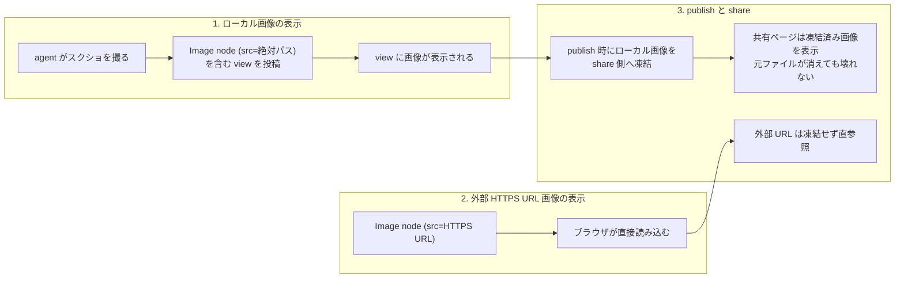

# image-view PRD

## Problem

syokan の view にはローカルファイルや外部 HTTPS URL の画像を表示できない。
画像を表す catalog node がなく、`Markdown` node も画像記法を POST 時に拒否するためである。

この制約が今問題になるのは、agent にブラウザ検証や UI レビューをさせる運用が定着し、スクリーンショットが検証証跡として日常的に生成されるようになったからである。
現在の syokan では、この証跡を含む view を組めないため、agent の検証結果を1つの view として確認できない。
また syokan の代表ユースケースである「今日の RSS」の view でも、記事のサムネイルや OGP 画像（外部 HTTPS URL）を表示できない。

view は share で他者に共有される。
共有ページで画像が見えなければ、スクリーンショット入りのレビュー結果を共有するという利用も成立しない。

## Overview

`Image` catalog node を新設し、view に画像を表示できるようにする。
node は `src`（必須。ローカル絶対パスまたは外部 HTTPS URL）と `alt`（任意）を持ち、キャプションやレイアウトは既存の流儀どおり `Stack`、`Card`、`Text` の合成で表現する。

この機能は性質の異なる三つの機能からなる。
セキュリティ境界と寿命と失敗条件がそれぞれ違うため、要件と Acceptance Criteria もこの単位で分ける。

1. **ローカル画像の表示**。
   画像バイトは envelope / store に持ち込まない（ephemeral 原則の維持）。
   画像として検証できたファイルだけを配信し、syokan 以外の Web ページからこの配信路を画像として読み込めないようにする。
2. **外部 HTTPS URL 画像の表示**。
   ブラウザが URL を直接読み込み、内容はサーバーで検証しない（読み込み失敗時のエラー表示のみ扱う）。
3. **publish と share**。
   publish 時にローカル画像を share 側ストレージへ凍結し、共有ページは凍結済み画像を表示する。
   share サーバーは、対応する share の生存中に限って asset への新規リクエストを受け付ける。
   失効した share の asset と、途中で失敗した publish の asset は、設計で定める期限内に物理削除する。ただし、失効または失敗から30日を超えない。
   外部 HTTPS URL の画像は凍結しない。

画像はクリックで拡大表示できる。
スクリーンショットは本文幅への縮小で文字が潰れるため、拡大手段は主ユースケースの成立条件に含める。

publish するローカル画像には二種類の制限を設け、それぞれ識別可能なエラーにする。

- **1枚あたりの入力制限**：10 MB まで、かつ総デコード画素数（アニメーション画像は全フレームの合計）50 メガピクセルまで。
  画素数の上限は、ファイルサイズ制限だけでは防げない閲覧者側のデコード負荷（巨大画像によるブラウザのメモリ枯渇）への安全上限である。
- **user あたりの総量 quota**：500 MB まで。
  計上単位は「share 側ストレージに物理的に保存されている asset のバイト数合計」で、share 間で同じ画像を使っても個別に計上する。
  削除、TTL 失効、publish 失敗のいずれの asset も、物理削除の完了をもって quota から回復する（通常は即時。遅くとも30日以内）。
  物理削除の完了を回復の条件にするのは、短命な share や意図的に失敗させた publish を繰り返しても、quota に計上されないストレージ使用が積み上がらないようにするためである。

### 許容するトレードオフ

- 外部 HTTPS URL の画像は共有ページでもブラウザが直接読み込むため、閲覧者の IP が画像の配信元に渡る。
  また元 URL が消えると共有ページの画像が壊れる。
- 外部 HTTPS URL の内容は検証しないため、巨大画像や SVG を外部 URL で参照する share は作れてしまう。
  その表示負荷とリスクは閲覧者のブラウザの耐性に委ねる（サイズと画素数の保護はローカル由来の凍結 asset のみが対象）。
- share の削除や失効後も、閲覧者のブラウザや CDN にキャッシュ済みの画像は、キャッシュ期限まで表示され得る。
  拒否を保証するのはキャッシュを介さずサーバーに到達する新規リクエストに対してのみとする。
- 公開された asset の URL は推測不能にするが、URL を知った第三者による画像の直接参照（hotlink による帯域の不正利用）は MVP では緩和しない。
- ローカル表示の読み取り信頼境界は TreeDoc と同じ（localhost バインドとユーザー権限）とし、読み取りパスの allowlist は設けない。
- ローカル画像はファイル参照の view になるため、元ファイルを消すとローカルでの再表示はできなくなる（TreeDoc と同じ性質）。

### Goals

- agent がスクリーンショットの絶対パスを `Image` node に書くだけで、view に画像が表示される
- 外部 HTTPS URL の画像も同じ node で表示される
- 共有ページでローカル由来の画像が表示され、元ファイルの生存に依存しない
- ephemeral 原則を維持する（ローカルの envelope / store は画像バイトを持たない。凍結は publish という明示的操作のときだけ）

### Non-Goals

- 動画と音声の表示
- 画像の圧縮とリサイズ（転送量の最適化は実測してから。安全のための入力制限とは別に扱う）
- SVG の表示（同一オリジン配信での XSS 対策が別途必要なため除外。図は既存の Mermaid node が担う。外部 HTTPS URL 経由の SVG はトレードオフ節のとおり検証対象外）
- data: URI による envelope への画像埋め込み
- ローカル画像の差し替えへの自動追従（表示中の view は追従せず、リロードで反映する）
- 外部 HTTPS URL 画像の内容検証と凍結（表示は best-effort とする）
- hotlink による帯域の不正利用の緩和
- `Markdown` node への画像記法の解禁（画像は `Image` node のみが担う）

## Glossary

- **envelope**：`POST /api/snapshots` に送る JSON。catalog tree を包む投稿単位。
- **publish**：view を公開する明示的な操作。
- **share**：publish で作られた公開単位。TTL で失効する。
- **asset**：publish 時に share 側ストレージへ凍結された画像ファイル。
- **凍結（materialize）**：publish 時に、ファイル参照をその時点の内容で固定する処理。既存では TreeDoc のツリー凍結が該当。
- **TTL**：share の生存期間。失効すると共有ページは見えなくなる。
- **新規リクエスト**：ブラウザや CDN のキャッシュを介さず、サーバーに到達するリクエスト。

## Acceptance Criteria

### ローカル画像の表示

- [ ] `src` に絶対パスを指定した `Image` node を含む envelope を投稿すると、view に画像が表示される
- [ ] agent が `GET /api/catalog` から `Image` の props 契約（`src` 必須、`alt` 任意）を取得できる
- [ ] 表示できる形式は png / jpeg / webp / gif / avif のラスター画像で、判定はファイル内容に基づく。拡張子だけが画像形式で内容が画像でないファイルや、regular file 以外を指すと、画像の位置にエラーが表示される
- [ ] 画像を読み込めない場合（ファイルが存在しない場合や読み取れない場合を含む）も、view のほかの内容は表示されたまま、画像の位置にエラーが表示される
- [ ] TreeDoc が読み込んだ tree に含まれる `Image` node も view に表示される
- [ ] 表示された画像をクリックすると拡大表示できる
- [ ] view を開いたまま元ファイルを差し替えても表示は変わらず、リロード後は新しい内容が表示される
- [ ] syokan 以外のオリジンの Web ページから、ローカル画像の配信 URL を画像として読み込めない

### 外部 HTTPS URL 画像の表示

- [ ] `src` に外部 HTTPS URL を指定した `Image` node を含む envelope を投稿すると、view に画像が表示される
- [ ] 読み込みに失敗した場合は画像の位置にエラーが表示される

### publish と share

- [ ] 成功した publish の共有ページでは、すべてのローカル画像が欠けることなく、公開前と同じ順序で表示される
- [ ] publish 後に元のローカル画像ファイルを削除しても、共有ページの画像は表示され続ける
- [ ] 外部 HTTPS URL の画像は、共有ページでも表示される（元 URL が読み込める間）
- [ ] 外部 HTTPS URL の画像は共有ページでのみ表示を許可し、landing など共有ページ以外の公開ページでは外部画像の読み込みがブロックされる
- [ ] 共有ページの応答からも asset の URL からも、元のローカルパスを知ることはできない
- [ ] ローカルパスを含む envelope を share API に直接送ると、publish が拒否される
- [ ] publish 時に読めないローカル画像があると publish 全体が失敗し、エラーに読み込めなかった `src` が含まれ、共有ページは作られない
- [ ] publish が途中で失敗した場合、共有ページも asset URL も取得できず、途中まで保存された asset は物理削除の完了をもって quota から回復する
- [ ] 失効した share の asset と途中で失敗した publish の asset は、設計で定めた期限内、かつ失効または失敗から30日以内にストレージから物理削除される
- [ ] 応答を受け取れなかった publish を再試行しても、share と quota 消費が重複しない（完了後に利用者が改めて行う publish は、従来どおり新しい share を作る）
- [ ] 1枚 10 MB または総デコード画素数 50 メガピクセルを超える画像を含む publish は、入力制限エラーで失敗する
- [ ] サイズ、画素数、形式の制限は、share サーバーが実際に保存するバイト列に対して検証され、正規クライアントを経由せず share API に直接送られた場合でも、制限を超える asset は公開到達可能にならない
- [ ] 生存中の share の asset 合計が user あたり 500 MB を超える publish は、入力制限エラーとは識別可能な quota エラーで失敗する
- [ ] quota の上限近くで複数の publish を並行実行しても、成功した publish の asset 合計は上限を超えない
- [ ] share を削除するか TTL が失効すると、その share の asset 分の quota が物理削除の完了をもって回復する（通常は即時）
- [ ] share を削除するか TTL が失効すると、共有ページと asset URL への新規リクエストはどちらも拒否される
- [ ] `Image` 非対応の共有サーバーへ画像を含む view を publish すると、asset の書き込みや quota の消費より前に明示的なエラーで失敗し、画像が欠けた share は作られない
