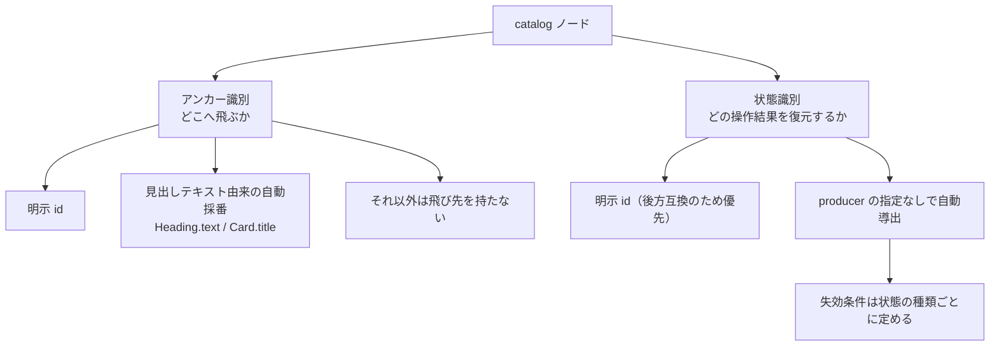

# node-identity

## Problem

catalog のノードは任意フィールド `id` を持てる。
この 1 つのフィールドが、性質の異なる 2 つの役割を兼ねている。

1. ビュー内アンカーの飛び先。`Link` の `href` に `#<id>` と書くと、そのノードへスクロールする
2. 閲覧者ローカル状態の識別子。`Checklist` のチェック、`Collapsible` の開閉、`Probe` の再実行結果を保存するときのキーになる

役割 1 は producer がアンカーを作るために明示的に使う機能である。
一方、役割 2 は `id` を指定した結果として生じる、producer からは見えにくい副作用である。
この兼務が 3 つの問題を生んでいる。

### `id` の指定漏れによる状態消失

`id` を持たないノードの状態はブラウザに保存されないため、リロードすると失われる。
このときエラーも警告も表示されないので、閲覧者は以前の操作結果を確認しようとするまで消失に気付けない。

この事故を避けるため、skill には「対話するノードには必ず `id` を付けろ」という運用規約が書かれている。
producer は、アンカーとして参照する必要のないノードにも `id` を振らされている。
しかも指定漏れは静かに失敗するので、規約が守られたかを投稿時に検証する手段がない。

### ビュー更新による状態消失

状態の失効判定は、ノードのサブツリー全体の内容が変わったかどうかで行っている。
そのため `Checklist` の項目を 1 つ書き換えると、書き換えていない項目のチェックまで落ちる。
`Collapsible` の本文が変わると、本文とは論理的に独立なはずの開閉状態まで落ちる。

`TreeDoc` は、LLM がファイルを書き換えビューがそれに追従することを前提にしたノードである。
その前提と現在の失効粒度を組み合わせると、`TreeDoc` 配下の `Checklist` は、サブツリーに変更が入るたびにチェックを失う。
レビューの進捗を追う用途では、進捗が残らない。

### `TreeDoc` 境界をまたぐ識別子の衝突

`TreeDoc` は参照先ファイルの内容を別のツリーとして描画するが、状態の保存スコープは外側の snapshot のままである。
外側のツリーと `TreeDoc` 配下に同じ `id` があると、アンカーの飛び先が曖昧になるだけでなく、保存された状態が混ざる。

### 今解決する理由

`TreeDoc` の導入により、LLM が表示中のツリーを継続的に更新する使い方が主流になった。
現在の識別方法では、更新のたびに閲覧者の操作状態が失われるため、レビュー進捗の管理という用途を安定して提供できない。

## Overview

`id` が担っている 2 つの役割を、アンカー識別と状態識別に分離する。
アンカー識別は producer が明示的に制御できる公開仕様として残す。
状態識別は producer の指定がなくても成立させる。
そのうえで状態の失効条件を、ノード全体の内容が変わったかどうかではなく、その状態にとって意味のある部分が変わったかどうかで判定する。

いずれの識別も、確定できないときは復元や移動を行わない。
状態が消えることは許容するが、ある操作結果が別のノードへ移ることは許容しない。

### 状態の継続性を保証する更新経路

「ビューを更新する」には 4 つの経路があり、状態の継続性を保証する範囲が異なる。

- 同じ `idempotencyKey` を使った既存 snapshot の更新：保証する
- `TreeDoc` の参照先ファイルの更新：保証する
- `idempotencyKey` なしの新規投稿：保証しない。別のビューとして扱う
- 公開共有への publish：保証しない。共有先は共有 URL ごとに独立した状態を持つ

### Goals

- `id` を指定しないノードでも、チェック、開閉、再実行結果がリロードを跨いで残る
- ビューを更新しても、変更されていない部分の状態は維持する。
  `Checklist` の 1 項目のラベルを変更しても、ほかの項目のチェックは維持する。
  `Collapsible` の本文を変更しても、開閉状態は維持する
- 識別が一意に確定できない場合、保存された状態を復元しない。
  異なるノードや異なる項目へ状態を適用しない
- アンカーの飛び先が一意に確定できない場合、いずれかへ飛ぶのではなく何も起こらない
- producer は見出しテキストから機械的に決まる文字列でその見出しへリンクできる
- producer が、アンカーとして参照しないノードに `id` を指定する必要をなくす
- `TreeDoc` の内側と外側で状態が混ざらない

### Non-Goals

- 閲覧者の操作状態を snapshot や `TreeDoc` の参照先ファイルへ書き戻すこと。
  syokan の ephemeral 原則を維持する。
  検討した経緯は Appendix に残す
- producer が状態の継続性を明示的に制御する専用フィールドの追加。
  自動導出で足りるかを先に確かめる
- catalog ツリー内でノードを移動または挿入したときに、そのノードの状態が追従すること。
  ここでいうノードは `Checklist` や `Collapsible` そのものを指す。
  `Checklist` の内部の項目については、Acceptance Criteria に定めた範囲で追従させる
- 見出しを書き換えたときに、その見出しが属する範囲のノードの状態が維持されること。
  状態識別は直近の見出しを手掛かりにするため、見出しの書き換えは配下の状態を失効させる
- 既存の閲覧者ローカル状態の移行。
  キー体系の刷新にあわせて破棄する
- `Collapsible` へアンカーで飛んだときの開閉挙動の変更。
  現在の「開いたまま残る」を維持する
- GitHub の見出し文字列規則との完全な互換。
  規則は syokan 自身のものとして定義しテストする
- `tags` および `TagFilter` に関する変更。
  別途削除が決まっている

## Glossary

- **producer**：snapshot を投稿する側。
  Claude Code、CLI、定期実行する agent などを指す
- **catalog ノード**：producer が JSON で投稿する UI 部品。
  `Heading`、`Card`、`Checklist` などがある
- **アンカー**：ビュー内の特定のノードへの参照。
  `Link` の `href` に `#` から始まる値を書くと、そのノードへスクロールする
- **飛び先文字列**：アンカーが指す先を表す文字列。
  `href` の `#` より後ろに書く
- **閲覧者ローカル状態**：チェック、開閉、`Probe` の再実行結果。
  閲覧者のブラウザにのみ保存され、snapshot には書き戻されない
- **失効**：保存された閲覧者ローカル状態を、内容が変わったとみなして復元しないこと
- **`TreeDoc`**：ローカルの JSON ファイルを参照し、ファイルの変更に追従して描画するノード
- **公開共有**：snapshot を外部から閲覧できる URL として publish する機能。
  publish 時に `TreeDoc` は参照先の内容へ固定され、`Probe` の再実行は無効になる

## Acceptance Criteria

### アンカー

- [ ] `Heading` と `Card` に、見出しテキストから決まる飛び先文字列が自動で付く。
      producer は `id` を指定しなくても、その文字列でその見出しへ飛べる
- [ ] 見出しテキストから飛び先文字列を決める規則が `syokan catalog` から取得できる。
      規則には、記号のみの見出し、絵文字を含む見出し、全角空白を含む見出し、大文字小文字の違いについて、生成される文字列または「飛び先を持たない」のどちらかが入力ごとに一意に定まる形で書かれている
- [ ] 同じ見出しテキストが複数あるとき、2 つ目以降には接尾辞が付いた別の飛び先文字列が割り当てられる。
      接尾辞の付け方は上記の規則に含まれる
- [ ] 見出しテキストの表記ゆれ（大文字小文字、空白、記号の有無）で書かれた `href` は、対応する見出しが 1 つに定まるときだけそこへ飛ぶ
- [ ] 上記で対応する見出しが 2 つ以上あるとき、いずれへも飛ばず、ビューは表示されたままになる
- [ ] producer が指定した `id` は、自動で割り当てられる飛び先文字列より優先される
- [ ] 存在しない飛び先文字列を含む URL を開いても、ビュー全体は表示され、エラー画面に遷移しない。
      空の飛び先文字列、`%` を含む解読できない飛び先文字列、極端に長い飛び先文字列でも同様である
- [ ] `TreeDoc` の中にあるノードを指す URL を開いたとき、参照先ファイルの読み込み後にそのノードへ飛ぶ

### 閲覧者ローカル状態

以下の「更新」は、同じ `idempotencyKey` での snapshot 更新、または `TreeDoc` の参照先ファイルの更新を指す。

- [ ] `id` を持たない `Checklist`、`Collapsible`、`Probe` でも、操作した状態がリロード後に残る
- [ ] `Checklist` の項目はラベルで対応づける。
      項目を挿入、削除、並べ替えても、ラベルが一致する項目のチェックは残る
- [ ] 同じラベルの項目が複数あるときは、`Checklist` 内での出現順で対応づける
- [ ] ラベルを書き換えた項目のチェックは落ちる。
      同じ `Checklist` 内のほかの項目のチェックは残る
- [ ] 項目の対応づけが一意に決まらないとき、その項目のチェックは落ちる。
      別の項目のチェックが移ることはない
- [ ] `Collapsible` の本文を変更しても、開閉状態は残る
- [ ] `Collapsible` の要約を変更すると、開閉状態は落ちる
- [ ] `Probe` の `check` が変わらない限り、更新しても再実行結果は残る
- [ ] `Probe` の `check` が変わると、再実行結果は落ちる
- [ ] `Probe` の `check` が同じとき、producer が投稿した測定結果と閲覧者の再実行結果のうち、測定時刻が新しい方が表示される。
      時刻が同じ場合と、producer が測定結果を持たない場合の表示も規則として定める。
      成功と失敗の別は優先順位に影響しない
- [ ] 見出しを書き換えると、その見出しが属する範囲のノードの状態は落ちる。
      別のノードへ状態が移ることはない
- [ ] `TreeDoc` の内側と外側に、同じ見出しと、その配下の同じ位置に `Checklist` を置いたとき、片方を操作してももう片方は変化しない。
      リロード後もそれぞれ独立に復元される
- [ ] 上記は、内側と外側に同じ `id` を指定した場合にも成立する
- [ ] 同じ snapshot の中で同じファイルを複数の `TreeDoc` から参照したとき、それぞれの状態は独立している
- [ ] 公開共有では、同じ共有 URL を同じブラウザで開き直したとき、`Checklist` のチェックと `Collapsible` の開閉が残る

### 既存ビューとの互換性

- [ ] ツリー全体で一意な `id` を持つ既存の snapshot は、再投稿せずにそのまま表示でき、アンカーも従来どおり動く
- [ ] 更新前に保存された閲覧者ローカル状態がブラウザに残っていても、snapshot を表示して操作できる。
      エラーは表示されない
- [ ] 閲覧者ローカル状態がブラウザに無制限に溜まり続けない。
      保持する上限、有効期限、削除の契機のいずれかが規則として定められ、それに従う

## Required Updates

プロダクトの振る舞いではないが、この PRD の完了に必要な変更を挙げる。

- in-repo skill `skills/syokan/` から「対話するノードには `id` を付けろ」という記述を削る。
  `id` はアンカーとして参照したいときに指定するもの、という説明に変える
- 飛び先文字列の規則は `GET /api/catalog` から配る。
  skill の markdown には転記しない
- `TreeDoc` 内のアンカー、飛び先の重複、`Checklist` の項目挿入と書き換え、`Probe` の測定時刻比較、リロードによる復元を、いずれも自動テストで検証する

## Appendix: 参照先ファイルへ状態を書き戻さない理由

`TreeDoc` の参照先ファイルに閲覧者のチェック状態を書き戻す案を検討し、却下した。

- ファイル内の位置による指定は、ノードを 1 つ挿入するだけでずれる。
  ずれたときの代償が、閲覧者ローカル状態の消失からユーザーのファイルの破壊に上がる
- LLM による全文の書き換えと、閲覧者による部分の更新が、同じファイルで衝突する
- ファイル読み取り API が読み取り専用であることを前提に、現在の信頼境界が許容されている
- 投稿された snapshot には同じことができない。
  同じノードの挙動が、置かれた文脈によって分かれる

具体的な実現方式と信頼境界の議論は decision log に残す。

