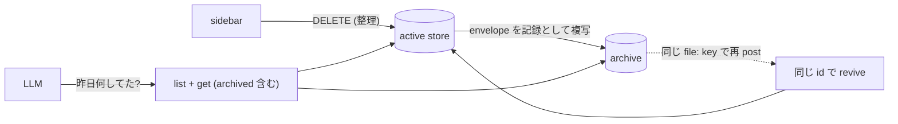

# PRD: snapshot-archive

## Problem

snapshot は「その時だけ見る」ための ephemeral な view として設計されたが、実態として「その日に何を見て・何を済ませたか」の記録が store にしか存在しない。view-writeback により check 状態まで store に書き戻されるようになったため、snapshot が持つのは LLM が post した内容の写しだけでなく、人間の操作痕跡でもある。

一方で現在の `DELETE` は destroy である。sidebar の整理操作が「その日の記録を消す」行為を兼ねてしまい、view-writeback で増えた書き戻しデータごと失われる。これまで `daily/` のような file で管理していれば「昨日何してたっけ」は振り返れたが、syokan だけを正本にすると削除のたびに記録が欠けていく。

解決として生成物を file へ export / 同期する道はあるが、正本が file と store に2つできる = view-writeback で潰した二重管理の復活であり、取らない。record と view が同じ store を共有するなら、そもそも同期の問題は存在しない。

## Overview

**`DELETE` を destroy から archive に変え、archived snapshot を queryable に保つ。** view の見かけは ephemeral のまま (sidebar から消える)、store の記録は log として残る。

### archive の意味論

- `DELETE /api/snapshots/:id` は envelope の写しを archive に記録として残し、active store から除く。`GET /api/snapshots` の一覧と view route からは消える (view から見れば delete と同じく not-found に落ち、SSE の delete 通知も同じく流れる)。`GET /api/snapshots/:id` 自体は引き続き envelope を返す (後述)
- archive は per-id の JSON file (`state/archive/<id>.json`) とし、再 archive 時は**最新の envelope で常に上書き**する。`archivedAt` は「最後に archive された時刻」を示す envelope の field であり、世代識別子ではない。過去状態の履歴は downstream git sync が担うため (後述)、product 内に世代管理は持たない — file 世代と git history の二重管理を避ける
- `GET /api/snapshots/:id` は **active / archived を問わず** envelope を返す — archived は「resource が消えた」のではなく「archive 状態にある」ので、plain GET の意味論に合わせて返し、response の `archivedAt` field (active では null) で状態を示す。**同一 id が active と archive に同居する場合 (revive 後) は常に active が勝ち、archive は active が無いときの fallback** — 同一 id に対して resource の現在形を返す、という plain GET の契約を維持する。archived を既定経路から外す必要があるのは list だけなので、query parameter での分離は `GET /api/snapshots?archived=1` のみとする (既定は active のみ)。`/api/snapshots/archived` のような literal segment は `:id` param と衝突するため置かない (Bun.serve の static-vs-param 解決順に依存させない)
- view route は `archivedAt` が立つ envelope を not-found として扱う (sidebar の整理操作が live view に影響しない = 従来の delete と同じ結末)

### revive (再 post = restore)

idempotencyKey の対応は archive 後も生かす。archive 済み snapshot と同じ key (`file:<abspath>` 等) で post された場合、その snapshot を **同じ id / URL のまま active に戻す**。

このとき **post された新しい envelope が勝つ** (PUT と同じく post 側が内容の正本)。archive 側の写し — 書き戻された check 状態を含む — は archive に残ったまま消費されない。つまり archive は「移動」ではなく「active から外れて記録に残る」のであり、revive は archive を空にしない。版を跨いだ check 状態のマージ (revive 時に旧 check を新 tree に写す等) は項目対応の問題を再導入するため持たない — 記録は archive にあり、view は post された最新の内容から始まる。

### LLM への query 経路

`GET /api/snapshots` 系は curl で既に引けるが、LLM の入口は CLI なので affordance を足す。

- `syokan snapshots list [--archived]` — id / title / createdAt (+ archivedAt) の一覧。`--archived` 時は archived id ごと1行を返す。日付で絞れること
- `syokan snapshots get <id>` — `GET /api/snapshots/:id` の envelope をそのまま出す。server 側で active → archive の順に解決されるため flag 類は一切不要 — LLM が「この id」で引くときに archive かどうかを事前に知る必要はない

これで「昨日の daily 何してた」は `list` で昨日付の snapshot を引き、`get` で中身を読む2手に落ちる。書き戻された check 状態も envelope に含まれるため「何を済ませたか」まで答えられる。

### retention と GitHub 管理の位置

archive は明示的に消すまで残す。肥大化が実害になったときの TTL / purge は別 PRD とする (Non-Goal)。

履歴・バックアップ・github.com 上の検索 UI は欲しいが、store / archive の backend を GitHub (git repo) にはしない。書き込み経路に外部 service を置くと、外部からの push / web 編集が store の write lock と CAS の合流点を迂回する — TreeDoc の file 参照と同型の split-brain になる上、localhost / offline / 秘密を持たない前提も崩れる。

一方で archive → git repo への commit / push は「書き込み済み envelope の downstream 複製」なので問題にならない。向きが一方向 (store → git) で store へ戻らない限り同期の問題は存在しない。したがって GitHub 管理は運用層の sync (cron / launchd で `git -C archive add -A && git -C archive commit -qm ... && git -C archive push`) で取るのが既定とし、product 側に入れる場合も `syokan archive sync` のような明示 command までとし、request path には入れない。archive には snapshot の内容と check 状態が含まれ、明示的に削除するまで残るため、sync 先は private かつアクセス制御された Git remote に限定する。

### Goals

- 「昨日・先週何を見て・何を済ませたか」を LLM が store から答えられる
- sidebar の整理操作が記録の喪失を伴わない
- view の見かけ・active store のコストは従来の ephemeral のまま

### Non-Goals

- archive の TTL / 自動 purge、pin、restore 専用 UI、archive の世代管理 (履歴は downstream git sync が担う。product 内で世代を持つと file 世代と git history の二重管理になる)
- store / archive の backend を GitHub (git repo) にすること (外部書き込みが合流点を迂回するため。履歴・backup は downstream sync で取る — 上記参照)
- share / publish 済み snapshot の archive (Worker 側の話)
- archived snapshot への書き戻し (archive は read-only の記録)

## Glossary

- **archive**: delete された snapshot の envelope が記録として残る保存領域 (per-id file・常に最新)。既定の一覧と view には出ないが `GET /:id` では引ける (`archivedAt` 付き)
- **revive**: archive 済み snapshot が同じ idempotencyKey の post により同じ id で active に戻ること。restore 専用の操作は持たない

## Acceptance Criteria

- [ ] `DELETE /api/snapshots/:id` した snapshot が一覧と view route から消え (view では not-found)、archive に envelope が残る
- [ ] archived snapshot は `GET /api/snapshots?archived=1` で一覧が取れる (既定の一覧は active のみ、archived id ごと1行)。`GET /api/snapshots/:id` は active / archived を問わず envelope を返し、archived の場合は `archivedAt` が設定される (どちらにも無ければ 404)。同じ id の再 archive は `state/archive/<id>.json` を最新 envelope で上書きする
- [ ] archive 時に開いている view は従来の delete と同じく not-found に落ちる (SSE で通知される)
- [ ] archive 済み snapshot と同じ idempotencyKey で再 post すると同じ id / URL が active に戻り、新しい envelope の内容が採用される。archive 側の記録 (旧 check 状態を含む) は残る
- [ ] `syokan snapshots list --archived` で archive 済みを含む一覧が引け、createdAt で日付を絞れる
- [ ] `syokan snapshots get <id>` が flag なしで archive 済み snapshot の envelope (書き戻された check 状態を含む) を返す

## Required Updates

- `AGENTS.md` — ephemeral 原則の記述を「見かけは ephemeral・記録は archive に残る」に更新し、directory 記述に archive を足す。XDG 3-way の表にある snapshots の backup 行 (`machine-local; survive restarts but need no backup`) も更新する — archive には check 状態を含む記録が入るため「no backup」の前提が変わる (downstream git sync がその受け皿)
- `src/lib/paths.ts` — `state/archive/` の path 解決を足す
- `src/schema/snapshot.ts` — response の `archivedAt` field (active では null) を envelope / summary の型と schema に載せる (envelope schema は `.strict()` のため要更新)
- `apps/syokan/server/store.ts` — `get(id)` を active snapshot → archive file の順に解決し、`archivedAt` を response に載せる
- `apps/syokan/server/routes.ts` — `GET /api/snapshots/:id` を上記の解決契約に合わせ、`GET /api/snapshots?archived=1` の一覧経路を足す
- `skills/syokan/` — delete が archive になること、`syokan snapshots` で過去の snapshot を引けることを明記する
- `apps/syokan/scripts/smoke.ts` — delete → archive → revive の leg を足す

## Success Metrics

- コアアクション: 過去の snapshot を LLM / CLI 経由で引き出すこと
- 期待頻度 (cycle): 週次 (「昨日何してた」「先週のあれ」の振り返り)
- 数える対象: archive 済み snapshot への `get` 呼び出し、および revive の発生回数
- 主指標: 「あの日何してた」系の問いに、file の記録を漁らず store の照会だけで答えられた割合
