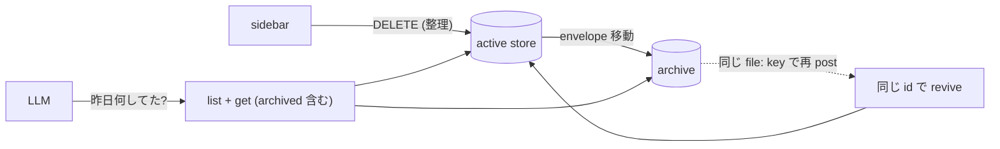

# PRD: snapshot-archive

## Problem

snapshot は「その時だけ見る」ための ephemeral な view として設計されたが、実態として「その日に何を見て・何を済ませたか」の記録が store にしか存在しない。view-writeback により check 状態まで store に書き戻されるようになったため、snapshot が持つのは LLM が post した内容の写しだけでなく、人間の操作痕跡でもある。

一方で現在の `DELETE` は destroy である。sidebar の整理操作が「その日の記録を消す」行為を兼ねてしまい、view-writeback で増えた書き戻しデータごと失われる。これまで `daily/` のような file で管理していれば「昨日何してたっけ」は振り返れたが、syokan だけを正本にすると削除のたびに記録が欠けていく。

解決として生成物を file へ export / 同期する道はあるが、正本が file と store に2つできる = view-writeback で潰した二重管理の復活であり、取らない。record と view が同じ store を共有するなら、そもそも同期の問題は存在しない。

## Overview

**`DELETE` を destroy から archive に変え、archived snapshot を queryable に保つ。** view の見かけは ephemeral のまま (sidebar から消える)、store の記録は log として残る。

### archive の意味論

- `DELETE /api/snapshots/:id` は envelope を active store から archive へ移す。`GET /api/snapshots` の一覧・`GET /api/snapshots/:id`・view route からは消える (view から見れば delete と同じく not-found に落ち、SSE の delete 通知も同じく流れる)
- archive は per-snapshot の JSON file (`state/archive/<id>.json`) とする。active store の単一 JSON を常に小さく保てる利点がある — 「記録は残すが live store は肥やさない」がこの設計の肝で、肥大化した場合の read/write コストを archive 側に逃がす
- archived snapshot の read は別経路 (`GET /api/snapshots/archived` 一覧 / `GET /api/snapshots/archived/:id`) に置き、既定の参照経路には混ざらない

### revive (再 post = restore)

idempotencyKey の対応は archive 後も生かす。archive 済み snapshot と同じ key (`file:<abspath>` 等) で post された場合、その snapshot を **同じ id / URL のまま un-archive** する。envelope は self-contained なので再 post はそのまま復活を意味し、「再打ちで同じ view」という ingest の不変条件が archive に対しても保たれる。

### LLM への query 経路

`GET /api/snapshots` 系は curl で既に引けるが、LLM の入口は CLI なので affordance を足す。

- `syokan snapshots list [--archived]` — id / title / createdAt (+ archivedAt) の一覧。日付で絞れること
- `syokan snapshots get <id> [--archived]` — envelope をそのまま出す

これで「昨日の daily 何してた」は `list` で昨日付の snapshot を引き、`get` で中身を読む2手に落ちる。書き戻された check 状態も envelope に含まれるため「何を済ませたか」まで答えられる。

### retention

archive は明示的に消すまで残す。肥大化が実害になったときの TTL / purge は別 PRD とする (Non-Goal)。archive file は素の JSON なので、運用側で `git commit` すれば履歴管理も product 変更なしに可能である。

### Goals

- 「昨日・先週何を見て・何を済ませたか」を LLM が store から答えられる
- sidebar の整理操作が記録の喪失を伴わない
- view の見かけ・active store のコストは従来の ephemeral のまま

### Non-Goals

- archive の TTL / 自動 purge、pin、restore 専用 UI
- archive の git 管理 (運用で可能・product の責務外)
- share / publish 済み snapshot の archive (Worker 側の話)
- archived snapshot への書き戻し (archive は read-only の記録)

## Glossary

- **archive**: delete された snapshot の envelope が移される保存領域。queryable だが active な参照経路には出ない
- **revive**: archive 済み snapshot が同じ idempotencyKey の post により同じ id で active に戻ること。restore 専用の操作は持たない

## Acceptance Criteria

- [ ] `DELETE /api/snapshots/:id` した snapshot が一覧と `GET /:id` から消え、archive に envelope が残る
- [ ] archived snapshot は `GET /api/snapshots/archived` で一覧でき、個別に envelope を取得できる
- [ ] archive 時に開いている view は従来の delete と同じく not-found に落ちる (SSE で通知される)
- [ ] archive 済み snapshot と同じ idempotencyKey で post すると、同じ id / URL で revive する
- [ ] `syokan snapshots list --archived` で archive 済みを含む一覧が引け、createdAt で日付を絞れる
- [ ] `syokan snapshots get <id>` が archive 済み snapshot の envelope (書き戻された check 状態を含む) を返す

## Required Updates

- `AGENTS.md` — ephemeral 原則の記述を「見かけは ephemeral・記録は archive に残る」に更新し、directory 記述に archive を足す
- `skills/syokan/` — delete が archive になること、`syokan snapshots` で過去の snapshot を引けることを明記する
- `apps/syokan/scripts/smoke.ts` — delete → archive → revive の leg を足す

## Success Metrics

- コアアクション: 過去の snapshot を LLM / CLI 経由で引き出すこと
- 期待頻度 (cycle): 週次 (「昨日何してた」「先週のあれ」の振り返り)
- 数える対象: archive 済み snapshot への `get` 呼び出し、および revive の発生回数
- 主指標: 「あの日何してた」系の問いに、file の記録を漁らず store の照会だけで答えられた割合
