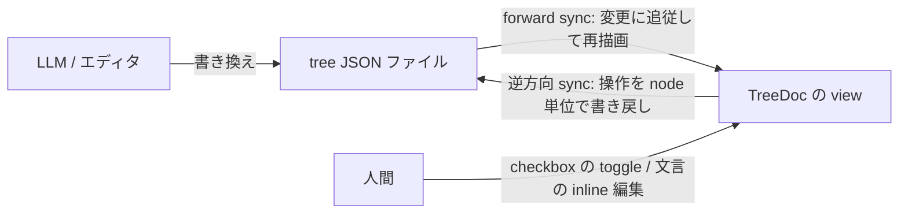

# PRD: tree-edit-writeback

## Problem

TreeDoc の live sync は一方向である。
LLM が参照先の catalog tree JSON を書き換えるとビューは追従するが、ビュー側からファイルへ働きかける手段はなく、view は読むだけの面にとどまっている。

このため「読みながらの軽い操作」に受け皿がない。
典型は、LLM が生成した今日の TODO やチェックリストを view で眺めながら消し込む場面である。
現状で項目を1つ消し込むには、LLM に依頼して JSON を書き換えさせるか、エディタで catalog tree JSON を直接編集するしかない。
1 bit の状態変更に LLM への往復は釣り合わず、raw な catalog JSON を人間が手で触るのは「構造化は LLM、人間は見る」という分業と逆行するうえ、編集ミスで tree を invalid にしやすい。
文言の軽微な修正 (typo、ラベルの言い換え) も同じ構図で、view 上で直せれば済むものに大きな迂回を強いている。

チェック状態を view 側 (ブラウザの localStorage 等) にだけ持つ案では、この課題は解けない。
状態がファイルに載らないため LLM から見えず、「LLM が tree を再生成したらチェックが消える」「別のビューや翌日の tree に引き継げない」という形で、ファイルを SSOT とする TreeDoc の前提と衝突するためである。
したがって、分業 (構造化は LLM、状態の SSOT はファイル) を保つには、状態をファイルへ書き戻す必要がある。

**逆方向 sync** (view 上の編集をファイルへ書き戻すこと) は、file-source-sync PRD (現 `archive/file-source-sync/`) で「read-only な render 層という syokan の責務を超え、編集 UI・write endpoint・変更監視との競合処理を抱え込む」としてスコープ外にした経緯がある。
この判断を反転するにあたり、責務の論点とコストの論点を分けて確認する。
責務について、書き戻し先はユーザー自身のファイルであり syokan の store には何も溜まらないため、ephemeral 原則 (syokan はデータを持たない) は保たれる。
syokan が持つ編集能力も「閲覧中に発生する、文言とチェック状態の局所的な修正」に限定し、tree の構造を組み替える能力は持たない (構造化は LLM の仕事のまま)。
render 層が汎用エディタへ滑り落ちる懸念には、この責務境界を本 PRD の Non-Goals として明文化することで答える。
コストについて、当時と違い json-only-view で file-backed view は catalog tree JSON の一種類に統一された。
任意テキストへの書き戻しは「どこを書き換えたか」を定義しづらかったが、catalog tree に対してなら「どの node のどの prop を書き換えたか」を構造的に定義でき、競合処理も node 単位に絞り込める。
コストの前提が変わった今が、この判断を反転する時である。

## Overview

TreeDoc 配下の view を直接操作できるようにし、操作を参照先の tree JSON ファイルへ書き戻す。
既存の **forward sync** (ファイル変更がビューに追従) と合わせて、file-backed view は双方向になる。

編集操作は次の2種類である。

- **Checkbox の toggle**：チェック状態を持つ catalog node を新設し、view 上のクリックで checked を切り替え、即座にファイルへ書き戻す。catalog に該当 type は存在しないため、本 PRD で **Checkbox** (文言 + チェック状態) を catalog に追加する
- **文言の inline 編集**：文言をその場でクリックして直接編集する。編集モードへの切り替え UI を挟まず、表示されているテキストがそのまま編集面になる。入力が途切れると自動で書き戻す (明示的な保存操作を要求しない)

### 編集対象の prop

inline 編集の対象は「人間が読む文言を表す prop」に限り、次の表で確定させる。
表にない prop は catalog type を問わず編集対象外である。

| catalog type | prop | 空文字 | 改行の入力 |
|---|---|---|---|
| Text | body | 不可 | 可 |
| Heading | text | 不可 | 不可 |
| Link | text | 不可 (未指定の Link は編集対象外) | 不可 |
| Badge | text | 不可 | 不可 |
| Checkbox | 文言 | 不可 | 不可 |

Code / Diff / Mermaid / PlainText の本文はコード片やログの転載であり、view 上で直す対象ではないため除外する。
URL や variant などの文言以外の prop も除外する。
Link の `text` は optional な prop であり、未指定の Link は href がそのまま表示される。
この場合に文言を新設するのは prop の追加であり、局所修正の範囲を超えるため編集対象外とする。

改行を許すのは複数行の本文を持ちうる Text の body だけである。
改行不可の prop では Enter は編集の確定として働く。
Text の body では Enter は改行として働き、確定は入力の途切れ (自動保存) と blur に任せる。
Esc はどの prop でも編集開始時点の内容に戻す。

### 書き戻しの規則 (node 単位マージ)

書き戻しは **node 単位マージ** で行う。
ファイル全体を view の状態で上書きするのではなく、書き戻し時点の最新のファイル内容を読み直し、編集した node の prop だけを更新して書き戻す。
これにより、ユーザーが view を操作している間に LLM が同じファイルの他の node を書き換えても、その変更は失われずビューにも反映される。

「編集した node」の同定は、参照先 tree 内の位置と内容の照合で行う。
編集を開始した時点の node と、書き戻し時点の最新ファイルの同じ位置にある node が、同じ type であり編集対象以外の prop も一致する場合に限り「同じ node」とみなして書き戻す。
安定した id を LLM に要求しない代わりに、照合が破れたら書き戻さない、という保守側に倒した規則である。

競合の期待結果は次の3つに分かれる。

- **他の node への外部変更**：ユーザーの編集と両立する。外部変更は view に反映され、ユーザーの書き戻しでも失われない
- **編集中の node 自体への外部変更** (prop の変更、削除、type の差し替え、前方への node 挿入による位置ずれを含む)：照合が破れるため書き戻さない。ユーザーの入力を黙って捨てず、その旨と入力内容を表示して回収可能にする
- **同一 node への書き込みの衝突が照合をすり抜ける場合** (照合と書き込みの間の時間差)：自動調停はせず、後の書き込みが勝つ。localhost の単一ユーザーが前提であり、この窓は実用上無視できる狭さとみなす

### ファイルの健全性

書き戻し後のファイルは常に valid な catalog tree JSON であることを保証する。
書き戻しの前後で、参照先の内容が TreeDoc の描画時と同じ規則 (parse、catalog schema 検証、TreeDoc の入れ子禁止) で valid であることを検証し、検証に失敗する書き戻しはファイルを変更しない。
空文字への編集確定など schema に違反する値も受け付けず、表示は元の文言に戻す。
LLM やエディタは書き戻し後のファイルをそのまま編集や再生成の入力にできる。

書き戻しで変わるのは編集した node の prop の値だけであり、他の node の値とキーの順序は変えない。
ただし書き戻しはファイルを tree として再シリアライズするため、インデント幅などの整形は syokan の正規形に揃う。
整形の差分が出るのは元ファイルが正規形でない場合の初回の書き戻しに限られ、以降の書き戻しの差分は編集した値だけになる。

### 編集できる場所

編集できる場所は TreeDoc 配下に限る。
「TreeDoc 配下」とは、TreeDoc が参照先ファイルから読み込んで描画した subtree の全 node を指す。
配下の node の書き戻し先は、その subtree を読み込んだ TreeDoc の参照先ファイルである。
1つの view に複数の TreeDoc が混在する場合も、各 node はそれぞれ自分を読み込んだ TreeDoc の参照先へ書き戻される。

編集可否は「書き戻し先ファイルがあるか」と一致させる。
通常 snapshot (envelope に直接入った tree) と share viewer (publish 時に凍結済み) には書き戻し先がないため、同じ catalog node でも read-only で表示する。
TreeDoc がエラーで直前の正常表示 (stale) を出している間も編集不可とする。
古い内容を土台に書き戻すと、ファイル側の新しい変更を巻き戻す事故になるためである。

### 書き込みの防御

書き込みはローカルの syokan サーバーを経由する。
任意パスへのファイル書き込みは読み取りより被害が大きい (ユーザーのファイルを破壊できる) ため、書き込みできる主体を syokan 自身の UI (同一 origin) に限定することを要件とする。
別 origin のページからのリクエストは、Web 上のページだけでなく localhost の別ポートで動くページも含めて拒否する。
「レスポンスが読めない」ことは防御とみなさず、書き込み自体が実行されないことを要件とする。

### Goals

- LLM が生成した checklist を、view 上のクリックだけで消し込めるようにする
- 文言の軽微な修正を、モード切り替えなしの inline 編集で完結させる
- 書き戻しを node 単位にして、LLM による同時変更と人間の操作を両立させる
- 書き戻し後もファイルが valid な catalog tree であり続けることを保証し、LLM との分業 (構造化は LLM) を壊さない

### Non-Goals

- node の追加、削除、並べ替え (構造編集) はしない。tree の構造を変えるのは LLM の仕事のままとする
- 編集対象の表にない prop (URL、variant、Code / Diff / Mermaid / PlainText の本文など) の編集はしない
- undo (Cmd+Z による書き戻し後の取り消し) は提供しない。履歴はファイル側 (git / LLM) に委ね、checkbox は再 toggle、文言は編集し直しで回復する。確定前の入力取り消しはブラウザ標準の挙動に任せる
- 通常 snapshot と share viewer の編集はしない (書き戻し先ファイルが存在しない)
- 同一 node への競合の自動調停 (CRDT、prop 単位のマージ等) はしない。照合が破れたら書き戻さず通知する、が競合処理のすべてである
- 参照先ファイルの新規作成はしない (存在するファイルへの書き戻しのみ)

## Glossary

- **forward sync**：参照先ファイルの変更が TreeDoc の view の再レンダリングとして反映されること (json-only-view で導入済み)
- **逆方向 sync**：view 上の編集操作が参照先ファイルへの書き戻しとして反映されること (本 PRD で導入)
- **Checkbox**：本 PRD で catalog に追加する node。文言とチェック状態を持ち、TreeDoc 配下では view 上の toggle がファイルに書き戻される
- **inline 編集**：表示中の文言をそのままクリックして編集すること。編集モードへの切り替え操作を挟まない
- **node 単位マージ**：書き戻し時点の最新のファイル内容に対し、位置と内容の照合で同定した編集対象 node の prop だけを更新する書き戻し方式

## Acceptance Criteria

編集操作:

- [ ] `Checkbox` type を含む envelope / tree JSON が描画され、`GET /api/catalog` にその props 契約が含まれる
- [ ] TreeDoc 配下の Checkbox をクリックすると表示が即座に切り替わり、参照先ファイルの該当 node のチェック状態が書き換わる
- [ ] TreeDoc 配下の編集対象 prop (表の5つ) の文言をクリックするとその場で編集でき、モード切り替えの UI を経由しない
- [ ] 文言の編集は、最後の入力から一定時間 (目安 1 秒以内) で自動的にファイルへ書き戻され、blur と (改行不可の prop では) Enter で即時に確定する
- [ ] 日本語入力の変換中 (IME composition 中) の未確定文字列は書き戻されない
- [ ] Esc で編集開始時点の内容に戻り、ファイルは書き換わらない
- [ ] 入力中に自分の書き戻しが forward sync で view に還流しても、カーソル位置や未確定の入力が失われない

ファイルの健全性:

- [ ] 書き戻し後のファイルは TreeDoc の描画時と同じ規則で valid な catalog tree JSON であり、再度 `syokan` できる
- [ ] 空文字など schema に違反する値で編集を確定しようとした場合、ファイルは書き換わらず表示は元の文言に戻る
- [ ] 2回目以降の書き戻しの diff は編集した prop の値の変更だけであり、他の node の値とキーの順序は変わらない

競合:

- [ ] ユーザーが編集している間に外部プロセスが同じファイルの他の node を書き換えた場合、その変更が view に反映され、ユーザーの書き戻しによっても失われない
- [ ] 編集中の node 自体が外部プロセスに変更、削除、または差し替えられた場合、ユーザーの入力は書き戻されず、その旨と入力内容が表示される

境界:

- [ ] 通常 snapshot (envelope に直接入った tree) では同じ node が read-only で表示され、toggle も inline 編集もできない
- [ ] share viewer では同じ node が read-only で表示され、toggle も inline 編集もできない
- [ ] TreeDoc 内の Checkbox を含む view を publish すると、その時点のチェック状態と文言で凍結された Checkbox が share ページに表示される
- [ ] share Worker API が TreeDoc を含む payload を拒否する既存の振る舞いは変わらない
- [ ] TreeDoc がエラー (stale 表示を含む) の間は編集できない

防御:

- [ ] 別 origin のページ (localhost の別ポートを含む) からの書き込みリクエストは、書き込み自体が実行されずに拒否される

ドキュメント:

- [ ] README の catalog type 一覧と syokan skill に Checkbox と編集可否 (TreeDoc 配下のみ編集可能) が記載されている
