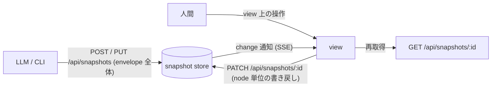

# PRD: view-writeback

## Problem

view 上での操作が、データに還らない。

典型は Checklist の消し込みである。LLM が生成した今日の TODO や review 観点を view で眺めながら check を入れても、その状態はブラウザの localStorage にしか載らない (`syokan:ui:<snapshot>:<node>:checks`)。このため、

- LLM から check 状態が見えない。次に tree を再生成するときに、何が済んだかを引き継げない
- node の内容が変わると hash が変わり、localStorage の mark は捨てられる
- share した view にも反映されない (publish されるのは envelope の中身だけ)
- 別デバイス・別ブラウザでは消える

一方、view から syokan へ書き戻す経路は存在しない。`POST /api/snapshots` は新規作成、`PUT` は envelope 全体の差し替えであり、「view を見ている人間が1箇所だけ直す」の受け皿がない。

この課題は tree-edit-writeback PRD ですでに定義されていた。ただし当時の解は「TreeDoc が参照する tree JSON ファイルへの書き戻し」で、正本が LLM と人間の双方が書くファイルであるために、node 単位マージ・位置照合・競合規則・ファイル健全性の保証を抱え込んでいた。

同時に、正本がファイルに散っていること自体が別の歪みを生んでいる。TreeDoc は「中身が envelope / store の外に住む」唯一の catalog node で、これ1つのために以下が維持されている。

- server が任意ローカルパスを読む (`/api/files`)。localhost bind の信頼境界の正当化はほぼこの endpoint のためだけにある
- ファイル watch + refcount + パスごとの SSE (`/api/files/watch`)
- publish 時にだけ走る freeze (materialize) と、worker 側の `treedoc_not_allowed` 防衛
- TreeDoc 入れ子 ban、mid-write 不正時の last-valid 保持などの特例処理
- ファイルの rename / move / delete で view が壊れる

## Overview

**view の正本を snapshot store に一本化し、view 上の編集は store への書き戻しとして成立させる。**

### snapshot の self-contained 化

正本が store のみになるよう、ファイル参照による view を廃止する。

- `syokan <file>` に bare catalog tree JSON を渡すと、内容を内包した envelope (`{ title: basename, root: <tree>, idempotencyKey: file:<abspath> }`) として post する。live な参照ではなく、その時点の内容が store に入る
- 同じファイルを書き換えて再実行すると、idempotencyKey により同じ snapshot がその場更新される (既存の PUT→404→POST 経路)。「編集 → view が追従」の loop は再打ちで再現される
- ファイルを移動した場合は別 key = 別 snapshot になる。内容は投げ込み済みなので、旧 view が dangling 参照で壊れることはない
- catalog から TreeDoc を削除し、`/api/files`・`/api/files/watch`・ファイル watch 機構を削除する
- publish は freeze を経ず、store の内容に probe redaction を掛けて worker に送るだけになる。`materialize_failed` / `treedoc_not_allowed` の系路も消える

### 書き戻し (node 単位 PATCH)

view からの編集は、**node id で同定した node の props 内の特定 path への set** として `PATCH /api/snapshots/:id` に送る。

- node id は ingest 時に tree 内一意が強制済みであり、書き戻し先の同定に使える
- set の対象は prop 内の path (例: Checklist node の `items.2.checked`) であり、node 全体や envelope 全体の上書きはしない。これにより、LLM が同じ snapshot の他の node を PUT で書き換えても人間の書き戻しは消えず、逆に人間の書き戻しが LLM の変更を巻き戻すこともない
- 対象の node id が store 上の最新 tree に存在しない場合 (LLM が該当 node を消した・差し替えた) は書き戻しを拒否し、view は操作を元に戻したうえでその旨を表示する。人間の操作を黙って捨てない
- PATCH は store の write lock の内側で最新 tree に適用するため、並行する PUT との間に read-modify-write の競合窓はない
- 書き戻せる node は store 上の snapshot を描く view に限る。share viewer (published な写し) と id を持たない node は従来通り read-only / device-local のままとする

### change 通知

更新されたことを、開いている view・一覧に push で届ける (SSE)。
「変わった」ことだけを流し、内容は受け手が GET で再取得する形は従来の files/watch と同じである。
ファイル watch は持たず、server 内で発行された mutation (create / update / delete / patch) を subscriber に流す in-process の通知とする。

これにより、

- LLM が PUT で再 post したとき、開いている view が reload なしに追随する (TreeDoc の live-follow を store 起点で代替)
- 人間が PATCH で書き戻したとき、同じ snapshot を開いている他の view も追随する
- 一覧も同じ通知で追随でき、現状の focus/visibilitychange 再取得の上位互換になる

store は他 process の書き込みを読み取りで拾う設計 (read-through) だが、通知は in-process のため同一 server を経由しない mutation は push されない。同一 data dir を複数 server が書くのは lazy-spawn が生じうる範囲の edge であり、focus 時の再取得が floor として残ることから許容する。

### 最初の編集操作: Checklist の check

書き戻しを持つ最初の操作は **Checklist item の check** とする (「TODO を消し込む」の本命)。
check は `items[i].checked` への PATCH として書き戻され、操作は optimistic に UI へ反映し、失敗時は元に戻して通知する。
id を持たない Checklist は書き戻し先を同定できないため、従来通り device-local の mark として動く (永続化したい node に id を付ける契約は現行と同じ)。

文言の inline 編集など他の操作も同じ PATCH で表現できるが、UI 面の検討が別途要るため本 PRD では扱わない (Non-Goals)。

### 書き込みの防御

mutation endpoint (snapshot の POST / PUT / PATCH / DELETE) へ別 origin のページからのリクエストは、書き込み自体が実行されないことを要件とする。localhost の別ポートで動くページも含む。publish 側に既にある cross-origin 拒否と同じ防御を、書き込み系 endpoint 全体に広げる。

### 永続化の範囲

check 状態は snapshot のデータに載るため、snapshot と同じ lifecycle を持つ (store が消えれば一緒に消える)。これは ephemeral 原則と整合する — 残したいものは template / share といった既存の昇格経路に乗る。
Collapsible の開閉や probe の実行結果など「表示上の状態」は従来通り device-local のままとし、永続化するのは「データとして意味を持つ状態」のみとする。

### Goals

- view 上の check 操作が snapshot のデータとして永続化され、reload・別端末・LLM の再読み込み・publish 後の share に一貫して現れる
- 人間の書き戻しが node 単位で行われ、LLM による同時の更新と両立する
- view の正本が store に一本化され、ファイル参照のための機構 (TreeDoc・files API・watch・materialize) が消える
- PUT / PATCH による更新が開いている view に reload なしで届く

### Non-Goals

- 文言の inline 編集、node の追加・削除・並べ替え (構造編集)。PATCH の経路はこれらも表現できる形にするが、編集 UI 自体は別 PRD とする
- id を持たない node への書き戻し (従来通り device-local)
- share viewer からの書き戻し (published な写しは read-only)
- CLI 側でのファイル watch (`syokan watch` 等の常駐)
- 既に store に残っている TreeDoc 入り snapshot の移行 (ephemeral のため unknown type 表示を許容)
- Collapsible 開閉・probe 結果など表示状態の永続化

## Glossary

- **self-contained snapshot**：内容がすべて envelope / store 内に入った snapshot。外部ファイルを参照しない
- **書き戻し (writeback)**：view 上の操作を snapshot store の該当 node へ反映すること。`PATCH /api/snapshots/:id` が担う
- **change 通知**：store の mutation (create / update / delete / patch) を開いている view・一覧へ届ける SSE。内容は流さず「変わった」ことだけを通知し、受け手は GET で再取得する
- **device-local UI state**：localStorage に置く表示上の状態 (開閉・transient な peek 等)。snapshot のデータには載らない

## Acceptance Criteria

書き戻し:

- [ ] id を持つ Checklist の item を check / uncheck すると、`items[i].checked` が store の snapshot に書き戻され、reload 後も保持される
- [ ] check を入れた snapshot を publish すると、share された view にも check 状態が現れる
- [ ] check 済みの状態は `GET /api/snapshots/:id` の内容に含まれ、LLM が次の tree を組み立てる際に読める
- [ ] 書き戻し対象の node id が最新の snapshot に存在しない場合、view の表示は操作前に戻り、書き戻せなかった旨が表示される
- [ ] id を持たない Checklist は従来通り動き、状態は device-local に留まる
- [ ] share viewer では check 操作が書き戻されない (表示のみ)

通知:

- [ ] 開いている view の snapshot が PUT / PATCH で更新されると、reload なしに新しい内容が表示される
- [ ] view を開いている最中にその snapshot が delete されると、not-found 表示になる
- [ ] 通知を受け取れない間 (接続断等) でも、次の通知・focus 時の再取得で内容が追随する

self-contained 化:

- [ ] `syokan <file>` に bare catalog tree JSON を渡すと内容を内包した envelope として post され、再打ちは同じ id/url の snapshot を更新する
- [ ] `type: "TreeDoc"` を含む post は validation_failed (400) になる
- [ ] `GET /api/files`・`GET /api/files/watch` が存在しない
- [ ] catalog registry・`GET /api/catalog` から TreeDoc が消える
- [ ] publish が freeze を経ずに成立する (`materialize_failed` / `treedoc_not_allowed` の系路が消える)

防御:

- [ ] 別 origin のページ (localhost の別ポートを含む) からの snapshot 書き込み系リクエストは、実行されずに拒否される

## Success Metrics

- コアアクション: view 上で Checklist の check を切り替えること
- 期待頻度 (cycle): 日次 (TODO / review の消し込みは日単位の習慣)
- 数える対象: 自分から view を開いたうえで check 操作を行った回数
- 主指標: check を入れた snapshot が、翌日以降に開き直しても check 状態を保持している割合 (永続化が機能していることの直接の指標)。副次として「check を使った snapshot が再生成されても check が引き継がれる」割合を見る
